# 🌱 Spring Core

## 📌 Spring Nedir?
Spring, Java ile geliştirme yaparken kullanılabilecek bir uygulama geliştirme frameworktür.  
Özellikle kurumsal projelerde hızlı ve güvenilir uygulamalar geliştirmek için popülerdir.  
Spring esnek, verimli ve hızlıdır.

Spring Boot, Spring çerçevesinin hızlı ve kolay kullanımı için geliştirilmiş bir yapılandırma aracıdır.  
Minimal konfigürasyonla mikroservisler oluşturmanıza olanak tanır.

Spring Boot, Spring Framework'ün hızlandırılmış ve basitleştirilmiş bir versiyonudur.  
Geliştiricilere minimal konfigürasyon gereksinimiyle, hızlı bir şekilde bağımsız, üretim seviyesinde  
Spring tabanlı uygulamalar geliştirme olanağı sağlar.

Geleneksel Spring uygulamalarında birçok XML tabanlı yapılandırma gerekiyorken,  
Spring Boot varsayılan ayarları kullanarak bu karmaşıklığı azaltır.

---

## 📌 Spring Core Nedir?
Spring Core, Spring Framework’ün **temel yapı taşıdır**.  
Uygulamanın nesne yönetimi, bağımlılıkların yönetimi ve yaşam döngüsü Spring Core tarafından sağlanır.

Spring Core’un merkezinde:
- **IoC (Inversion of Control)**
- **DI (Dependency Injection)**
- **Bean Management**

kavramları yer alır.

---

## 🎯 Spring Core Ne Sağlar?
- Nesnelerin Spring tarafından yönetilmesi
- Bağımlılıkların manuel oluşturulmaması
- Daha esnek, test edilebilir ve sürdürülebilir kod yazımı

### ✅ Avantajları
1. **Kolay Konfigürasyon**  
   Varsayılan ayarlar ve otomatik yapılandırmalar sayesinde minimum manuel konfigürasyon.
2. **Yerleşik Sunucu**  
   Tomcat, Jetty veya Undertow gibi yerleşik sunucularla uygulamayı dış bir sunucuya deploy etmeden çalıştırma.
3. **Hızlı Başlangıç**  
   Spring Initializr gibi araçlarla hızlı proje oluşturma.
4. **Mikroservis Mimarisine Uyum**  
   Dağıtık sistemler ve mikroservisler için uygundur.
5. **Üretim Seviyesi Hazırlık**  
   Actuator, güvenlik ve kolay konfigürasyon seçenekleri sunar.

Ek olarak:
- Modüler yapı sayesinde yalnızca ihtiyaç duyulan bileşenler kullanılır
- Dependency Injection (DI) ve Aspect-Oriented Programming (AOP) sağlar
- MVC, REST API, veri erişimi (JPA/Hibernate) için hazır çözümler sunar

Spring Boot, kompleks Spring uygulamalarının temellerini basitleştirerek hız ve verimlilik sağlar.

---

## 🎯 Spring’in Temel Amacı
- Java tabanlı uygulamalarda tekrar eden işleri en aza indirmek
- Modüler bir yapı sunmak
- Karmaşık kurumsal uygulamaları daha hızlı geliştirmek

---

## 🧩 Spring Framework’ün Modülleri
1. **Spring Core** – IoC ve DI işlemlerini yönetir
2. **Spring MVC** – Web uygulamaları geliştirmek için kullanılır
3. **Spring Data** – Veri erişim işlemleri için (JPA, JDBC)
4. **Spring Security** – Kimlik doğrulama ve yetkilendirme
5. **Spring Boot** – Hızlı proje oluşturma ve yapılandırma

---

## 🔍 Spring’in Diğer Frameworklerden Farkı
- IoC ve DI sayesinde düşük bağımlılık
- Kolay entegre edilebilir modüller
- Çeşitli veri tabanı desteği
- Açık kaynaklı yapı

---

## 📦 Bağımlılıklar (Dependencies)
- **Spring Web**: RESTful API ve web uygulamaları
- **Spring Data JPA**: Veri tabanı işlemleri
- **H2 Database**: Hafif, yerleşik test veritabanı
- **Spring Boot DevTools**: Otomatik restart ve geliştirme kolaylığı

---

## ▶️ Proje Başlatma
Main sınıfı çalıştırılarak Spring Boot uygulaması başlatılır.  
`@SpringBootApplication` anotasyonu ile uygulama otomatik olarak ayağa kalkar.

### 🔑 @SpringBootApplication Anotasyonu
@SpringBootApplication , üç önemli anotasyonu bir araya getirir:
1. @Configuration : Uygulamanın yapılandırmasını belirtir ve Spring IoC container'a bean'leri
tanıtır.
2. @EnableAutoConfiguration : Spring Boot'un otomatik yapılandırma özelliğini etkinleştirir,
yani projenizdeki bağımlılıklara göre varsayılan konfigürasyonları yükler.
3. @ComponentScan : Projedeki bileşenlerin (controller, service, repository gibi) taranmasını ve
Spring container'a eklenmesini sağlar.

### Örnek Spring Boot Ana Sınıfı:

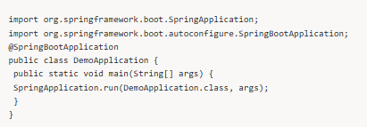

### Uygulamanın Başlatılması:
Bu ana sınıfı çalıştırdığınızda Spring Boot, uygulamanızın temel yapılandırmalarını otomatik
olarak yapar ve yerleşik bir sunucu (Tomcat gibi) üzerinde uygulamanızı çalıştırır. Uygulamanız
artık http://localhost:8080 adresinde hizmet verir.

---

## 🔁 Inversion of Control (IoC)

### 📌 IoC Nedir?
IoC, nesnelerin **oluşturulma ve yönetim sorumluluğunun**
uygulamadan alınıp **Spring Container’a verilmesidir**.

Yani:
- Nesneleri `new` ile biz oluşturmayız
- Spring, ihtiyaç duyulan nesneleri üretir ve yönetir

Uygulamanın akış kontrolünün geliştiriciden alınarak Spring Framework gibi bir container'a devredilmesidir.  
Spring, sınıfları oluşturur ve ilişkileri yönetir.  
Normalde geliştiricinin sorumluluğunda olan nesne yönetimi ve bağımlılıkların çözümü artık IoC Container tarafından yapılır.

Containerın içine tanımlayıp istediğin sınıf içerisinden tanımlamış olduğun nesneyi istediğin sınıfın içine enjekte et.

Normalde bir nesne oluştururken:

Service service = new Service();

IoC ile Spring bunu sizin yerinize yapar.

Ioc ile birbirnin alternatifi olan işleri yönetiyoruz ,bu yapıyı ayağa kaldıran yapı ise dependency ınjection.

Örnek:  

Manuel kontrol ile bir sınıfın bağımlılığını oluşturmak:

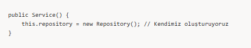

---

## 💉 Dependency Injection (DI)

## 📌 DI Nedir?
DI, bir sınıfın ihtiyaç duyduğu bağımlılıkların
**Spring tarafından dışarıdan verilmesidir**.

Bu sayede:
- Sınıflar birbirine sıkı sıkıya bağlı olmaz
- Test yazmak kolaylaşır

Bir sınıfın ihtiyaç duyduğu bağımlılıkların (dependency) dışarıdan sağlanması işlemidir. Örneğin, bir servis sınıfı bir repository sınıfına ihtiyaç duyarsa, Spring bu bağımlılığı otomatik olarak inject eder.

Sınıfların içine enjekte etmeye dependecy ınjectıon denir.

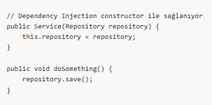

---

## 🧩 DI Türleri

### 1️⃣ Constructor Injection (ÖNERİLEN)

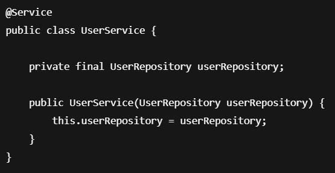

✅ En güvenli ve test edilebilir yöntemdir.

2️⃣ Setter Injection

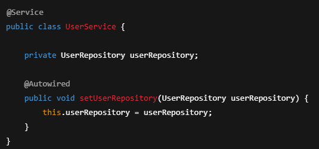

3️⃣ Field Injection (ÖNERİLMEZ)

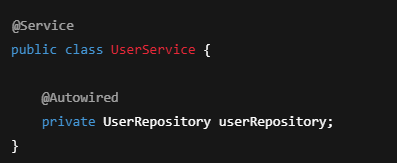

❌ Test edilebilirlik ve okunabilirlik düşer.

Bean Kavramı

📌 Bean Nedir?

Spring Container tarafından oluşturulan ve yönetilen nesnelere Bean denir.

Bir sınıfın Bean olabilmesi için Spring tarafından taranması gerekir.

Sık Kullanılan Spring Anotasyonları

@Component

Genel amaçlı Spring Bean tanımıdır.;

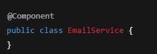

@Service

İş mantığı (business logic) içeren sınıflar için kullanılır.

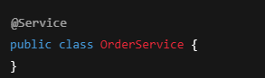

@Repository

Database erişimi yapan sınıflar için kullanılır.

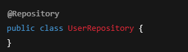

@Service ve @Repository, aslında @Component’in özel halleridir.

Spring Container

Spring Container:

Bean’leri oluşturur

Bağımlılıkları enjekte eder

Bean yaşam döngüsünü yönetir

Spring Boot projelerinde en sık kullanılan container:

ApplicationContext

🔄 Bean Scope Türleri

singleton (varsayılan)

Uygulama boyunca tek bir nesne

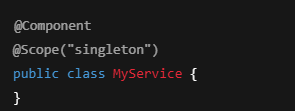

prototype

Her istekte yeni nesne

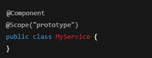

⚠️ Sık Yapılan Hatalar

- Her yerde new kullanmak

- Field Injection tercih etmek

- Bean olmayan sınıflarda Spring anotasyonu beklemek

- IoC ve DI kavramlarını karıştırmak

🧠 QA Perspektifinden Spring Core

- DI sayesinde mock kullanımı kolaylaşır

- Unit test yazımı basitleşir

- Sınıflar izole şekilde test edilebilir

✅ Özet

Spring Core:

- Spring Framework’ün temelidir

- IoC ve DI prensipleri üzerine kuruludur

- Daha temiz, esnek ve test edilebilir kod yazmayı sağlar

## ☕ JDK Nedir?

**JDK (Java Development Kit)**, Java programlama dilini kullanarak uygulamalar geliştirmek için gereken araçlar topluluğudur.

JDK şunları içerir:
- **JRE (Java Runtime Environment)**: Java uygulamalarını çalıştırmak için gerekli.
- **Compiler (javac)**: Java kodlarını bytecode’a çevirir.
- **Araçlar**: `javadoc`, `javap`, `jar` gibi geliştirme araçları.

Jdk kendi içinde bir jre ve jvr barındırır.  
jre içişnde bazı kütüphaneler vardır classlar, metotlar yani java ile ilgili geliştirme yapmamızı sağlayan kütüphaneler vardır yani java çalıştırma ortamıdır.  
jvr java sanal makine demektir java yapmış olduğumuz uygulamanın windows,linux , mac gibi ortamlarda çalışmasını sağlar.

- `java -version` → java versiyonu

---

## 📦 Maven

Maven springte indireceğimiz bağımlılıkları kendi içinde localinde tutacak ve bunu projem ayağa kalktığında vermiş olduğumuz bağımlılıkları ordan okuyup kullanıp uygulamamızı başarılı bir şekilde ayağa kaldırılabilmesini sağlayan ve kendi içinde bağımlılıkları tutacak bir yapıdır.

- **artifact**: projenin adı
- **pom.xml**

Maven projelerinde yapılandırma dosyasıdır.  
Proje bağımlılıklarını, yapı ayarlarını ve eklentilerini burada tanımlarsınız.

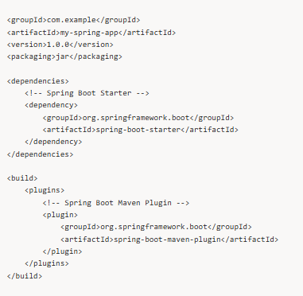

---

## 📌 Maven Nedir?

Maven bağımlılıkları yönetmek için kullanılır.  
Maven şunu yapıyor bizim yerimize, bizim pom.xml içerisine eklemiş olduğumuz bir tane bağımlılığı eklediğimizde maven bu bağımlılığı ilgili olduğu jar dosyalarını kendi repositorysinden bulup maven dependency altına ekliyor.

Jar dosyalarının yönetimini sağlıyor.  
Proje şablonları sağlıyor maven bu da standartlaştımada çok etkili.

- **Bağımlılık Yönetimi**: Projenizin ihtiyaç duyduğu kütüphaneleri otomatik olarak indirir.
- **Build Otomasyonu**:  
  `mvn install`, `mvn clean` (Derleme sırasında oluşan geçici dosyaları temizler) gibi komutlarla projeyi derleyebilir ve çalıştırabilirsiniz.  
  (Build yani versiyon takip sistemi sunuyor maven.)

Pom.xml içerisine bir bağımlılık eklediğimizde maven pom.xml içerisine bakar bu bağımlılığın bizim kendi local repositorymizde eklediğimiz dependecylerde bunu arar (m2 klasörü local maven repository).  
Eğer bulursa oradan alır, bulamazsa maven central (maven ın kendi repositorysi) repository e bakar, oradan alır ve local repoya kaydeder.

Kısaca uygulamayı çalıştırıyoruz bizim maven dependencies içindeki local repomuza bakıyor, orda bulursa ordan okuyup ayağa kaldırıyor, bulamazsa maven kendi repositorysine gidiyor ordan bulup bilgisayarımıza kaydettikten sonra okuyup o şekilde ayağa kaldırıyor.

Hibernate, spring yeni bir veriyon çıkardığı zaman bunu mavena yüklüyor.  
Yani mavenın bir repositorysi var. Maven repositoryde java projeleinin jarları duruyor.  
Projede maven repositorye bağlanıyoruz bu da tek bir noktadan projeleri yönetebilmemizi sağlıyor.

- **maven repository**:  
  C nin altında, kullanıcılar, gulsenemguven, `.m2`, `repository`

---

## 🌐 Tomcat Nedir?

Java Servlet ve JSP (Java Server Pages) uygulamalarını çalıştırmak için kullanılan bir web sunucusudur.  
Spring Boot projelerinde genelde gömülü olarak gelir.

Tomcat bir uygulama sunucusudur.  
Yazdığımız uygulamayı çalıştırıp derleyip ayağa kaldırıyor ve daha sonra http protokolü üzerinden dışarı açmış oluyor.  
Hem hataları yönetmemizi hemde uygulamamızı ayağa kaldırmamızı sağlıyor.

---

## 🌱 Spring Context ve Bean Kavramı

### Spring Context
Spring IoC Container'ının bir uygulama nesnelerini yönetme ortamıdır.  
Tüm `@Component` veya `@Bean` nesnelerini burada tutar.

### Bean
Spring tarafından yönetilen bir nesnedir.  
Örneğin, bir servis sınıfı veya repository sınıfı bir bean olabilir.

@Component
class MyService {
    public void doTask() {
        System.out.println("Task is being executed!");
    }
}

Bizim açtığımız java classlarımız birer beandir.  
Biz java classlarımızı spring context içinde saklıyoruz ve daha sonra ihtiyacımız olduğunda kullanıyoruz.  
Spring context e, application context ya da Ioc Container de denilir.

Context içine bir tane bean ekleyebilmek için:
- `@Bean` anatasyonunu
- stereotype anatasyonları (`@RestController`, `@Service`, `@Repository`, `@Controller`)
- veya programmatically

şeklinde ekleyebiliriz.

`@Configuration` : configürasyon sınıfı olduğunu belirtir.

Kısaca spring context denen bir şey var, bean denen bir şey var.  
Bean dediğimiz şeylerin de aslında birer java classs olduğunu ve bizler bu oluşturmuş olduğumuz java classlarını
bazı yöntemler kullanarak spring context e eklediğimizi,
bunu spring contexttende ihtiyacımız olduğu sınıflarda çekip kullandığımızı söyleyebiliriz.

Spring context kullanırsak her ihtiyacımız olan sınıfta
context e ihtiyacımız olan sınıfı ordan çekerim,
bütün sınıflar aynı şeyi kullanmış olurlar.

Her defasında yeni yeni carlar üretmektense
bir tane car sınıfını context e koyup
bütün sınıflar aynı car nesnesini alır.

Tek bir nesne tanımlayıp onu bir yere koyup
tüm sınıflar üzerinden o tanımlamış olduğumuz bean i alıyoruz.

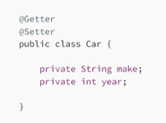
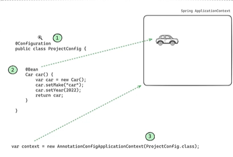

---

## 🧰 Lombok Nedir?

**Lombok**, Java kodunu basitleştiren bir kütüphanedir.  
Örneğin, getter/setter yazmanıza gerek kalmaz.

Getter setter constructor gibi anatasyonları kullanarak
getter setter yazmaktan kurtaran bir yapıdır.

lombok u kur, lombok un bağımlılığı pom.xml e ekle

- `@Getter`  
  Sınıfın her bir alanı için **getter** (get metodu) oluşturur
- `@Setter`  
  Sınıfın her bir alanı için **setter** (set metodu) oluşturur
- `@NoArgsConstructor`  
  Parametresiz bir **constructor** oluşturur
- `@AllArgsConstructor`  
  Tüm alanları kapsayan bir **constructor** oluşturur

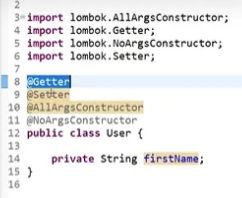

---

## 🫘 Bean Oluşturma

Geriye dönüş tipi void değil userservice tipinde olmalıdır.  
Bean kullanmazsak ve newlersek içindeki değeri kaybederiz.

`@Configuration` ve `@Bean` anatasyonlarını kullarak context e yazdırdık,
sonra oluşturmuş olduğumuz beanlerimizi çektik.

Bir kere newliyoruz bunu contexte dolu bir şekilde koyuyoruz,
daha sonra dolu bir şekilde farklı farklı sınıflardan
o nesneyi çekip kullanmış oluyoruz.

Newlersek içindeki her şey gider.

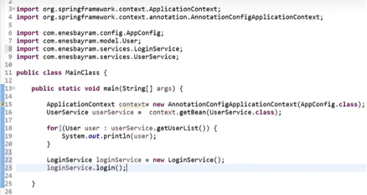

---

## ⚙️ @Configuration ve @Bean

- `@Configuration`  
  Bir sınıfın Spring tarafından yapılandırma sınıfı olarak algılanmasını sağlar.  
  Bu sınıf, Spring IoC container'a özel bean tanımlamalarını
  ve uygulama yapılandırmalarını içerir.

### Temel Özellikler
1. **Yapılandırma Tanımlamak için Kullanılır**  
   Bean tanımları ve ilişkili bağımlılıkların yönetimini sağlar.
2. **İçindeki Metotlar `@Bean` ile İşaretlenir**  
   Her bir metot bir bean tanımıdır.
3. **Singleton Davranışı**  
   Varsayılan olarak, `@Configuration` sınıfındaki tüm bean'ler **singleton** olarak yönetilir.

- `@Bean`  
  Bir metot tarafından döndürülen nesnenin Spring IoC container'da
  bir bean olarak yönetileceğini belirtir.  
  Bu anotasyon genellikle `@Configuration` anotasyonu ile işaretlenmiş sınıflarda kullanılır.

### Temel Özellikler
1. **Manuel Bean Tanımı**  
   Spring tarafından otomatik tarama yerine bean'leri manuel olarak tanımlamanıza olanak tanır.
2. **Bağımlılık Yönetimi**  
   Bean'lerin bağımlılıklarını metot parametreleri aracılığıyla çözebilir.