# Spring Boot REST API

## REST API Nedir?

Web API (Application Programming Interface), web tabanlı yazılımların ve hizmetlerin
diğer uygulamalarla iletişim kurmasını sağlayan bir protokol ve yapıdır.

Sorgulama butonu istemci (client) oluyor.  
Yani istemci ne demek? O isteği atan, o aksiyonu gerçekleştiren, ana sayfa üzerinde
işlem yapmamızı sağlayan taraftır.  
Butona bastığımızda uygulamamız RESTful servise gidiyor, öğreniyor ve geri dönüyor.

İsteği atan taraf client, isteği aldığımız yer serverdır.  
Web servisleri HTTP protokolleri üzerinden çalışan yapılardır.

---

### Tanım

- REST (Representational State Transfer), HTTP protokolü üzerinde çalışan bir web hizmeti mimarisidir.
- REST API, istemci (client) ve sunucu (server) arasında iletişim sağlamak için REST prensiplerine uygun olarak tasarlanmış bir arayüzdür.
- Kaynaklara (resources) erişmek için URI (Uniform Resource Identifier) kullanır.

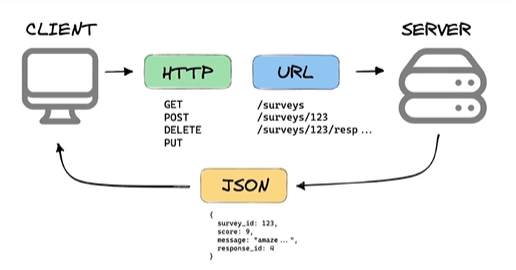

---

## Spring Boot ile REST API’ler

Spring Boot ile REST API’ler:
- Web uygulamaları
- Mobil uygulamalar
- Mikroservisler  
için geliştirilir.

---

## REST API Temel Prensipleri

- Stateless yapıdadır
- HTTP metotları kullanılır
- Kaynak (resource) odaklıdır
- JSON veri formatı yaygındır

---

## HTTP Metodları

Veri almak istiyorsak **GET** kullanırız.  
Ekleme yapıyorsak **POST**, güncelleme yapıyorsak **PUT** kullanırız.

- **GET:** Kaynağı getirmek (okuma)
- **POST:** Yeni bir kaynak oluşturmak (ekleme)
- **PUT:** Mevcut kaynağı güncellemek
- **DELETE:** Kaynağı silmek
- **PATCH:** Kaynağın bir kısmını güncellemek

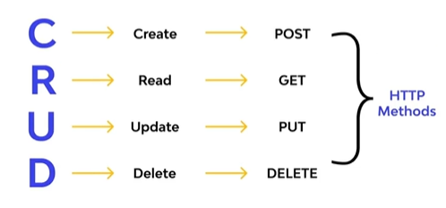

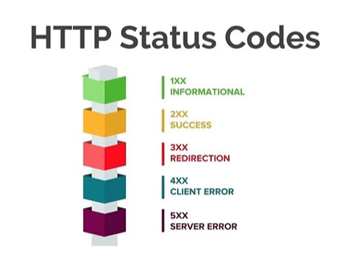

---

## HTTP Status Code’lar

Client tarafından server tarafına bir istek attık, URL adresini hazırladık,
gönder dedik.  
Server tarafında bu işlendi ve bize bir geri dönüş yapıyor.  
Geri dönüş yaparken başarılı mı oldu, başarısız mı oldu diye HTTP kodlarımız var.

- **1xx:** 1 ile başlayanlar genelde bilgilendirici olur
- **2xx:** Server tarafından başarılı cevap alınır  
  - **200:** OK – İstek başarıyla tamamlandı  
  - **201:** Created – Yeni bir kaynak başarıyla oluşturuldu
- **3xx:**  
- **4xx:** Client taraflı hatalardır. Yanlış request atılmış olabilir, token süresi dolmuştur gibi  
  - **404:** Not Found – Kaynak bulunamadı  
  - **400:** Bad Request – Geçersiz bir istek gönderildi  
  - **403:** Yetkisiz giriş
- **5xx:** Server hatalarıdır  
  - **500:** Internal Server Error – Sunucu tarafında bir hata oluştu

---

## Katmanlı Mimari Nedir?

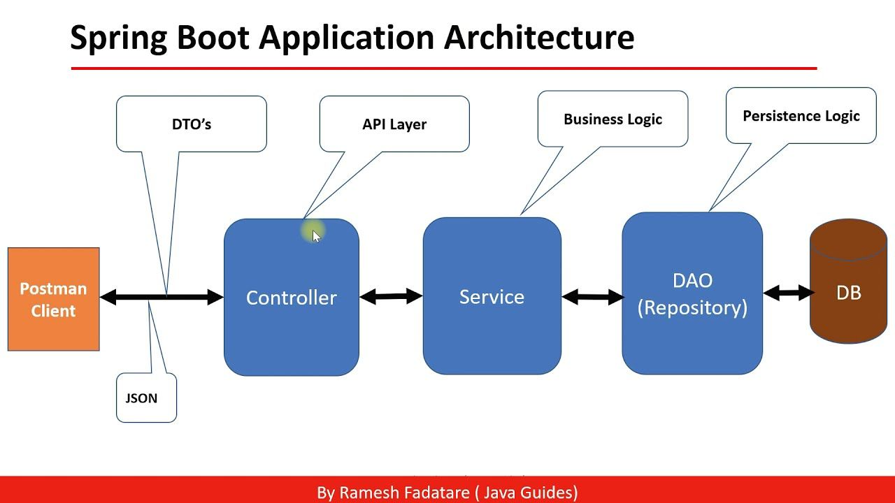

Katmanlı mimari, bir uygulamanın farklı işlevsel bölümlerini
bağımsız katmanlara ayıran bir tasarım modelidir.

---

### Spring Uygulamalarındaki Katmanlar

1. **Controller (Sunum Katmanı):** İstemciden gelen istekleri alır ve cevap verir.
2. **Service (İş Katmanı):** İş kurallarını ve mantığını içerir.
3. **Repository (Veri Erişim Katmanı):** Veritabanı ile iletişim kurar.

---

## MVC Yapısı

MVC (Model – View – Controller)

Controller – Service – Repository (VT’ye bağlandığımız katman)

İsteğimizi ilk karşılayan katman controller katmanıdır.  
Daha sonra isteği service katmanına gönderir.  
Service katmanı burada kontrolleri gerçekleştirir; servis dediğimiz yer aslında
kontrollerin ve logic işlemlerin gerçekleştiği yerdir.

Eğer service katmanında bir sıkıntı oluşursa, bunu geri controller katmanına gönderir.
Controller da bunu tekrar başarısız olarak kullanıcıya döndürür.

Eğer bir sıkıntı yoksa akış şu şekilde ilerler:

Controller → Service → Repository

Repository katmanı veritabanına erişmek için kullandığımız katmandır.
Database gerekli olan verileri bulur, repository’e gönderir.
Repository bunu hiçbir işlem yapmadan service katmanına döner.
Service katmanı veriyi alır ve controller’a döner.
Controller da bunu client yani isteği atan kişiye döndürür.

## @RestController Nedir?

`@RestController`, Spring Boot’ta REST API geliştirmek için kullanılan temel anotasyondur.

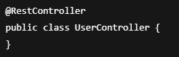

### Özellikleri

- `@Controller` ve `@ResponseBody` birleşimidir
- Metotlardan dönen veriler doğrudan JSON olarak response’a yazılır
- View (HTML) döndürmez

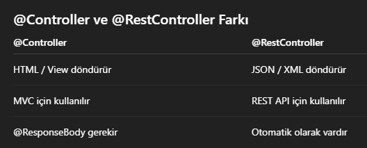

---

## @RequestMapping Nedir?

Controller veya metot seviyesinde URL tanımlamak için kullanılır.

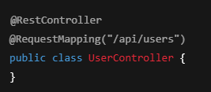

Bu durumda tüm endpoint’ler `/api/users` ile başlar.

---

## HTTP Metotları

### @GetMapping

Veri okumak için kullanılır.

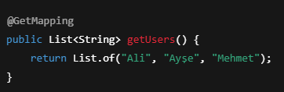

---

### @PostMapping

Yeni veri oluşturmak için kullanılır.

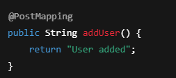

---

### @PutMapping

Mevcut veriyi güncellemek için kullanılır.

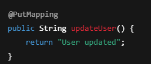

---

### @DeleteMapping

Veri silmek için kullanılır.

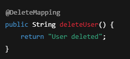

---

## @PathVariable Nedir?

URL içerisindeki dinamik değerleri almak için kullanılır.

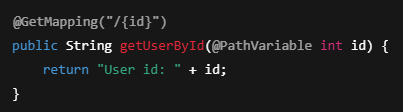

### Örnek istek

---

## @RequestParam Nedir?

Query parametrelerini almak için kullanılır.

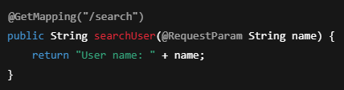

### Örnek istek

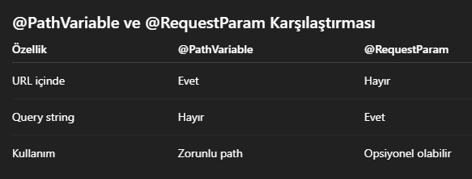

---

## @RequestBody Nedir?

Client’tan gelen JSON verisini Java nesnesine dönüştürür.  
Veri eklemek için kullanılır.  
HTTP POST isteği ile gelen JSON verisini Java nesnesine dönüştürmek için kullanılır.

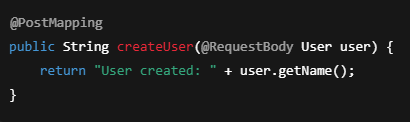

### Örnek JSON

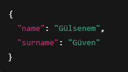

---

## ResponseEntity Nedir?

HTTP response’u status code ve header ile birlikte yönetmeyi sağlar.

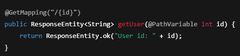

---

## Özet

- REST API’ler Spring Boot’un temel yapı taşlarındandır
- `@RestController` API geliştirmek için kullanılır
- HTTP metotları doğru senaryoda tercih edilmelidir
- `@RequestBody`, `@PathVariable` ve `@RequestParam` iyi bilinmelidir
- `ResponseEntity` profesyonel API’lerde önerilir

- **Controller Katmanı:** Dışardan gelen isteği karşılamak için kullanılır.  

`@RestController` anotasyonu kullanılarak bunun bir controller katmanı olduğu belirtilir.

- **Service:** Logic işlemler yapmak için kullanılır. İş mantığının yer aldığı katmanı ifade eder.  

`@Service` anotasyonu kullanılarak bunun bir servis katmanı olduğu belirtilir.

- **Repository:** Veri tabanına erişmek için kullanılır. Veritabanı işlemleri için kullanılan katmandır.  

`@Repository` anotasyonu ile repository katmanı olduğu belirtilir.

---

Spring context içinde bunlardan birer tane bean oluşur.

Peki biz bunları birbirine nasıl gönderiyoruz ya da geçiyoruz yani controllerdan service ya da servisten repositorye?

`@Autowired` anotasyonu ile autowired enjekte etmek demektir.  
`@Autowired`, Spring context’te service bean’ini alır ve bunu yerleştirir.  
Böylece controller, service katmanına erişmiş olur.

- **IoC:** Spring context’te bir bean oluşturduğumuzda, bu bean’lerin oluşturulması ve yönetiminin Spring’e devredilmesine IoC denir.
- **Dependency Injection (DI):** Bean’i alıp herhangi bir class içerisine enjekte etmeye denir.

Context’ten aldığımız verileri `@Autowired` ile enjekte ederek servisler arasında geçiş yapmış oluruz.

`@Autowired`: Spring tarafından bean’lerin otomatik olarak enjekte edilmesini sağlar.

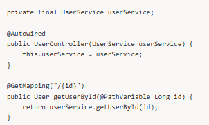

---

# REST API – GET İsteği ve Mimarinin Kurulması

## REST API Mimarisi Nedir?

REST API mimarisi, uygulamanın katmanlara ayrılarak
daha **okunabilir**, **bakımı kolay** ve **test edilebilir**
hale getirilmesini amaçlar.

Spring Boot’ta REST API mimarisi genellikle şu katmanlardan oluşur:
- Controller
- Service
- Repository
- Model (Entity / DTO)

---

## Katmanlı Mimari Yapısı

### Controller Katmanı
- Client’tan gelen HTTP isteklerini karşılar
- Response döndürür
- İş mantığı içermez

### Service Katmanı
- İş kuralları burada yazılır
- Controller ile Repository arasında köprü görevi görür

### Repository Katmanı
- Veritabanı işlemlerini yapar
- Spring Data JPA ile kullanılır

### Model Katmanı
- Entity ve DTO sınıflarını içerir
- Veri yapısını temsil eder

---

## Paket Yapısı Örneği

com.example.demo
 ├── controller
 │    └── UserController.java
 ├── service
 │    └── UserService.java
 ├── repository
 │    └── UserRepository.java
 ├── model
 │    └── User.java
 └── DemoApplication.java

---

## GET İsteği Nedir?

GET isteği, server’dan veri okumak için kullanılır.  
Veri üzerinde herhangi bir değişiklik yapmaz.

---

## Controller Katmanı – GET Endpoint

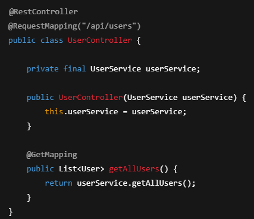

---

## Service Katmanı

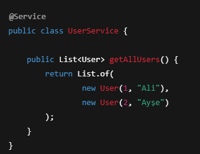

---

## Model (Entity) Kavramı

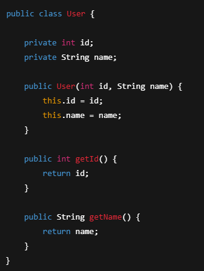

---

## GET İsteğinin Çalışma Akışı

- Client, GET isteği gönderir
- Controller isteği karşılar
- Service katmanına yönlendirir
- Service veriyi hazırlar
- Controller response döndürür
- Client JSON formatında veriyi alır

---

## Örnek GET İsteği

---

## Dönen JSON Response

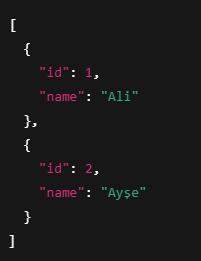

---

## Neden Katmanlı Mimari Kullanılır?

- Kod okunabilirliği artar
- Test yazmak kolaylaşır
- Değişiklikler izole edilir
- Büyük projelerde yönetilebilirlik sağlar

---

## Özet

- GET isteği veri okumak için kullanılır
- REST API mimarisi katmanlara ayrılarak kurulur
- Controller yalnızca isteği karşılar
- Service iş mantığını yönetir
- Bu yapı profesyonel Spring Boot projelerinin temelidir
