# Spring Data JPA

Veri tabanına bağlandığımız bölüm.

---

## Spring Data JPA Nedir?

Spring Data JPA, Spring uygulamalarında  
veritabanı işlemlerini daha **kolay**, **okunabilir** ve **hızlı**  
bir şekilde yapmamızı sağlayan bir Spring modülüdür.

JPA (Java Persistence API) standardını kullanır  
ve ORM (Object Relational Mapping) yaklaşımını temel alır.

Java tabanlı bir framework olan Spring Framework’ün bir parçasıdır.  
JPA (Java Persistence API), Java uygulamalarında nesne ilişkisel eşleme (ORM)
için standart bir API’dir.  
Spring Data JPA bu standart API’yi kullanarak veritabanı işlemlerini
kolaylaştıran ve hızlandıran bir arayüz sağlar.

Veri tabanına bağlanıp orada işlemler yapmamızı sağlayan ara katmandır.

Spring Data JPA arka planda Hibernate kullanır.  
Hibernate, elimizdeki Java class’larını veritabanındaki tablolarla
mapleyen yapılardır.

---

## Neden Spring Data JPA Kullanılır?

- SQL yazma ihtiyacını azaltır
- CRUD işlemlerini otomatik sağlar
- Repository katmanını sadeleştirir
- Veritabanı bağımsız çalışmayı sağlar
- Bakımı kolay ve sürdürülebilir yapı sunar

---

## ORM Nedir?

Nesne tabanlı programlama dili ile ilişkisel bir veritabanı arasındaki
uyumsuzluğu gidermek için kullanılan bir programlama tekniğidir.  
Java class’ımızı ORM ile database’e bağlıyoruz.

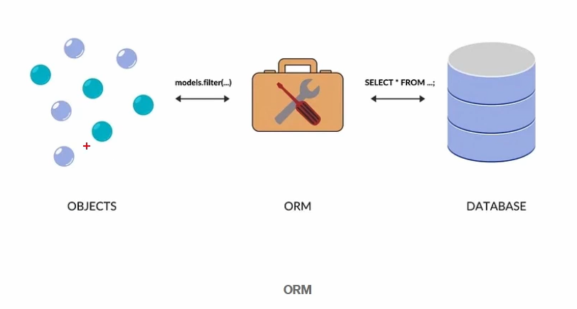

---

## application.properties

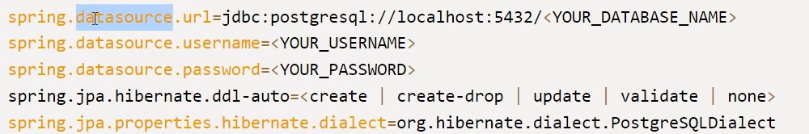

---

## JPA ve Hibernate İlişkisi

- **JPA:** Java için bir standarttır
- **Hibernate:** JPA’nın en yaygın kullanılan implementasyonudur
- Spring Boot varsayılan olarak Hibernate kullanır

---

## ORM (Object Relational Mapping) Nedir?

ORM, Java nesneleri ile  
veritabanı tabloları arasındaki  
eşleştirmeyi otomatik olarak yapan yaklaşımdır.

- Class ↔ Table
- Field ↔ Column
- Object ↔ Row

---

## Entity Nedir?

Entity, veritabanındaki bir tabloyu temsil eden Java sınıfıdır.

- `@Entity` anotasyonu ile işaretlenir
- Her entity bir tabloya karşılık gelir
- Primary key zorunludur

## Basit Entity Örneği

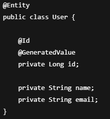

---

## Repository Nedir?

Repository, veritabanı işlemlerini yapan katmandır.

Spring Data JPA sayesinde  
CRUD işlemleri için ekstra kod yazmamıza gerek kalmaz.

---

## JpaRepository Kullanımı

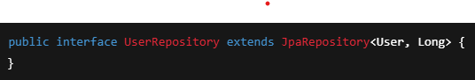

Bu interface ile:

- findAll()
- findById()
- save()
- deleteById()

metotları otomatik olarak gelir.

---

## Spring Data JPA Akışı

- Controller isteği alır
- Service katmanına yönlendirir
- Service, Repository’i çağırır
- Repository, veritabanı ile iletişime geçer
- Sonuç Service → Controller → Client

---

## Özet

- Spring Data JPA, JPA standardı üzerine kuruludur
- Hibernate varsayılan implementasyondur
- ORM ile nesne–tablo eşleştirmesi yapılır
- Repository katmanı CRUD işlemlerini yönetir
- Profesyonel Spring Boot projelerinin temel parçalarındandır

# Spring Data JPA ile Proje Açılışı

*[spring.io](http://1.spring.io) dan gerekli dependency’leri ekle.  
Dosyayı generate et, ayıkla ve Maven’a ekle.

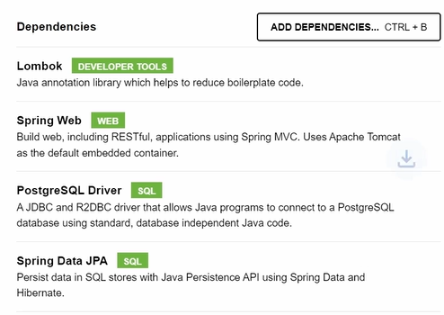

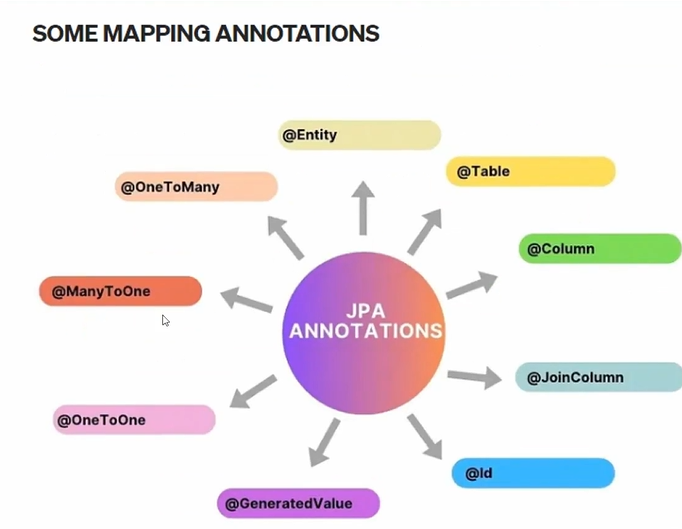

---

## @Entity

Bir Java sınıfının, veritabanındaki bir tabloyu temsil ettiğini belirtir.

- JPA tarafından yönetilen bir sınıf olduğunu ifade eder
- Her `@Entity` bir tabloya karşılık gelir
- Primary key (`@Id`) zorunludur

---

## @Table

Entity’nin hangi veritabanı tablosuna karşılık geldiğini belirtir.

- Tablo adı özelleştirilmek istendiğinde kullanılır
- Yazılmazsa class adı tablo adı olarak alınır

---

## @Column

Bir alanın (field), veritabanındaki hangi kolona karşılık geldiğini belirtir.

- Kolon adı, uzunluk, nullable gibi özellikler tanımlanabilir
- Yazılmazsa field adı kolon adı olarak kullanılır

---

## @Id

Bir entity’nin **primary key** alanını belirtir.

- Her entity’de mutlaka bulunmalıdır
- Veritabanındaki benzersiz kimliği temsil eder

---

## @GeneratedValue

Primary key değerinin nasıl üretileceğini belirtir.

- Otomatik ID üretimi sağlar
- Genellikle `@Id` ile birlikte kullanılır
- Identity, Sequence, Auto gibi stratejileri vardır

---

## @JoinColumn

İlişkisel tablolarda **foreign key** kolonu belirtmek için kullanılır.

- İlişkinin hangi kolon üzerinden kurulacağını ifade eder
- Genellikle `@ManyToOne` ve `@OneToOne` ile kullanılır

---

## @OneToOne

İki tablo arasında **bire bir** ilişki olduğunu belirtir.

- Bir kaydın sadece bir karşılığı vardır
- Örnek: User ↔ UserDetail

---

## @ManyToOne

Bir tablodaki birçok kaydın, başka bir tablodaki tek bir kayda bağlı olduğunu belirtir.

- En sık kullanılan ilişki türüdür
- Foreign key bu tarafta tutulur
- Örnek: Order → User

---

## @OneToMany

Bir tablodaki tek bir kaydın, başka bir tablodaki birçok kayda karşılık geldiğini belirtir.

- Genellikle `@ManyToOne`’ın ters tarafıdır
- Liste veya Set yapısı ile kullanılır
- Örnek: User → Orders

---

## Özet

- `@Entity` → tabloyu temsil eder
- `@Id` → primary key’i belirtir
- `@GeneratedValue` → ID üretim stratejisini belirler
- `@Column` → kolon detaylarını tanımlar
- `@JoinColumn` → foreign key’i belirtir
- `@OneToOne`, `@ManyToOne`, `@OneToMany` → tablo ilişkilerini tanımlar

# Spring Data JPA ile REST CRUD (GET / POST / PUT / DELETE) ve @PathVariable

Bu bölümde Spring Data JPA kullanarak temel CRUD endpoint’lerini  
(GET, POST, PUT, DELETE) ve `@PathVariable` kullanımını  
örnek bir yapı üzerinden gösteriyoruz.

---

## Örnek Katmanlı Mimari

- **Controller:** HTTP isteklerini karşılar
- **Service:** İş mantığını yürütür
- **Repository:** Veritabanı işlemlerini yapar (Spring Data JPA)
- **Entity:** Tabloyu temsil eder

---

## 1) Entity (User)

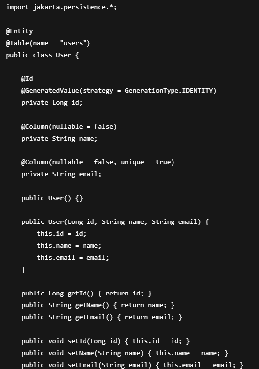

---

## 2) Repository (UserRepository)

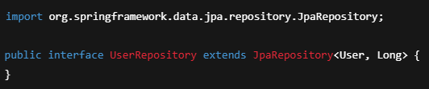

`JpaRepository<User, Long>` sayesinde aşağıdaki metotlar hazır gelir:

- findAll()
- findById(id)
- save(entity)
- deleteById(id)
- existsById(id)

---

## 3) Service (UserService)

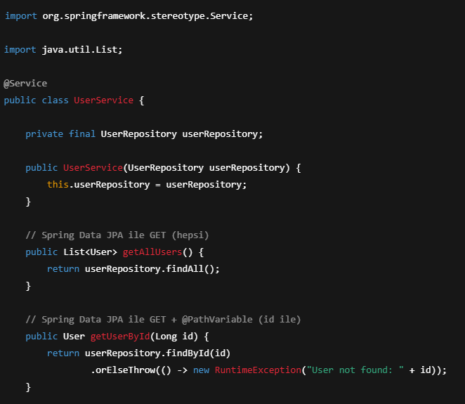

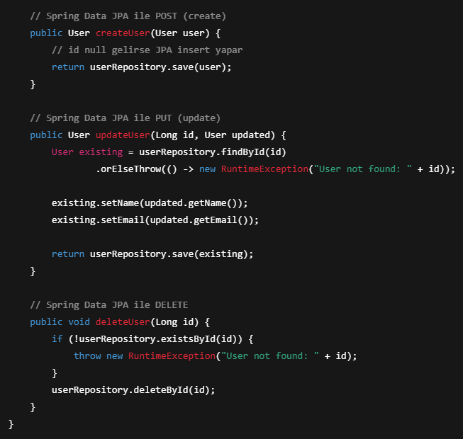

---

## 4) Controller (UserController)

Base path:

/api/users

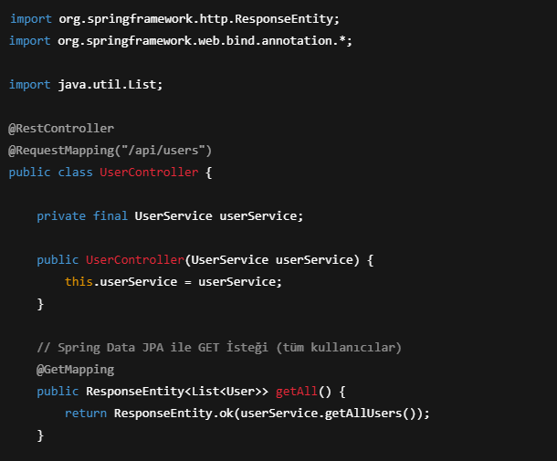

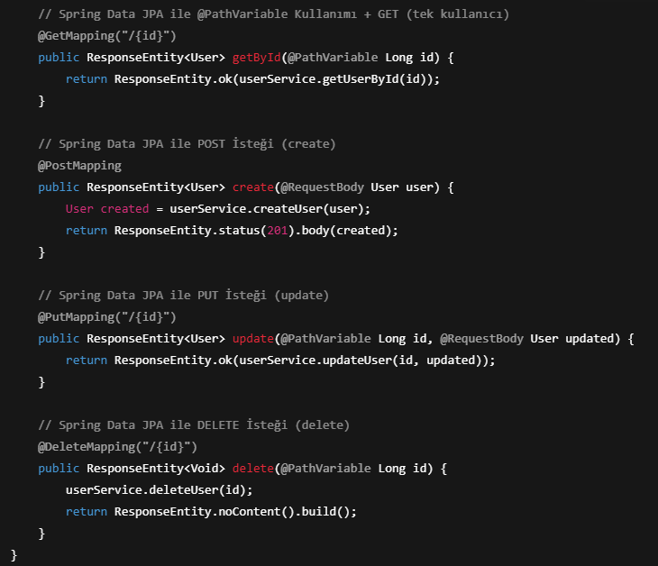

---

## İstek Örnekleri

### GET (tüm kayıtlar)

---

### GET + @PathVariable (tek kayıt)

---

### POST (create)

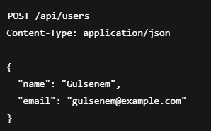

---

### PUT (update)

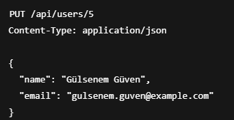

---

### DELETE

---

## Özet

- **GET** → `findAll()`, `findById(id)`
- **POST** → `save(entity)` (insert)
- **PUT** → önce `findById`, sonra alanları güncelle, sonra `save` (update)
- **DELETE** → `deleteById(id)` (gerekirse `existsById` ile kontrol)
- **@PathVariable** → URL içindeki dinamik değeri parametre olarak alır  
  (ör: `/api/users/{id}`)
