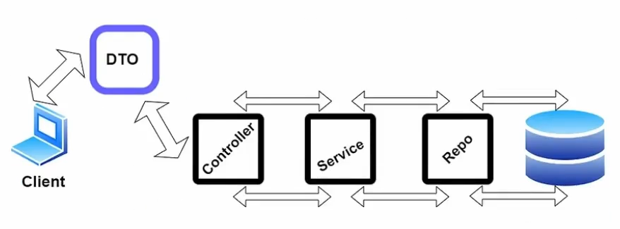
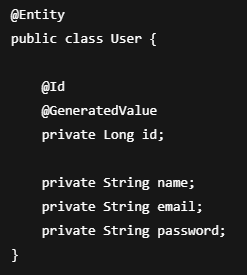
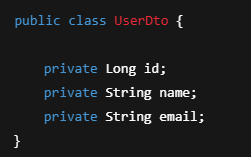
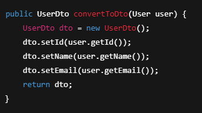
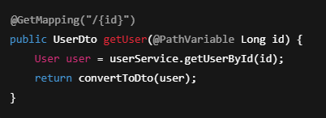

# DTO (Data Transfer Object)

## DTO Nedir?

DTO (Data Transfer Object), katmanlar arasında veya  
client ile server arasında **veri taşımak** için kullanılan  
basit Java sınıflarıdır.

Hem verinin korunması, hem de ihtiyacının olduğu kadar veriyi çağıran  
(@Entity anotasyonu ile işaretlediğimizde bütün veriler geliyor, bu da
yoğun oranda güvenlik açığına el veriyor) yapıya DTO denir.  
Buradaki amaç, client olan uygulamalara hangi alanları göstermek
istediğimizdir. Hangi field’lar transfer edilsin, hepsini istemiyoruz
çünkü.

Bir servis yazarken o servisin parametresini DTO olarak veririz.  
Servisi çağıran kişiye de DTO olarak döner.

DTO’lar:
- Sadece veri taşır
- İş mantığı (logic) içermez
- Getter / Setter yapılarından oluşur

---

## DTO Neden Kullanılır?

Entity sınıflarını doğrudan client’a açmak **önerilmez**.

DTO kullanmanın temel sebepleri:

- Güvenlik sağlar (gereksiz alanlar client’a gönderilmez)
- API response’ları kontrol altına alınır
- Entity değişse bile API bozulmaz
- Performans iyileştirmesi sağlar
- Temiz ve profesyonel mimari oluşturur

---

## Entity ile DTO Arasındaki Fark

### Entity
- Veritabanını temsil eder
- JPA anotasyonları içerir
- Database ile birebir ilişkilidir

### DTO
- Client’a gönderilecek veriyi temsil eder
- JPA anotasyonu içermez
- Sadece ihtiyaç duyulan alanları içerir

---

## Entity Örneği

Bu entity’i direkt client’a dönersek:

password gibi hassas bilgiler açığa çıkar

## DTO Örneği

Bu DTO ile:
- Sadece gerekli alanlar client’a gönderilir
- Güvenlik sağlanır

---

## DTO Nerede Kullanılır?

- Controller katmanında response dönerken
- RequestBody olarak veri alırken
- Service katmanında entity ↔ dto dönüşümlerinde

---

## Entity → DTO Dönüşümü (Manuel)

---

## Controller’da DTO Kullanımı

---

## DTO Kullanmanın Sağladığı Avantajlar

- API contract netleşir
- Client ile server bağımlılığı azalır
- Test yazmak kolaylaşır
- Büyük projelerde sürdürülebilirlik sağlar

---

## Özet

- DTO, veri taşımak için kullanılan nesnedir
- Entity ile DTO aynı şey değildir
- Entity veritabanını, DTO client’ı temsil eder
- Profesyonel Spring Boot projelerinde DTO kullanımı standarttır

---

# Servisleri DTO’ya Dönüştürme ve @Query Kullanımı

## Servisleri DTO’ya Dönüştürme

Service katmanında genellikle:
- Veritabanından **Entity** alınır
- Client’a dönerken **DTO**’ya dönüştürülür

Bu sayede:
- Entity yapısı client’tan gizlenir
- API response’ları kontrol altına alınır
- Daha güvenli ve sürdürülebilir bir yapı kurulur

---

## Neden Dönüştürme Service Katmanında Yapılır?

- Controller sade kalır
- İş mantığı tek bir yerde toplanır
- Controller yalnızca isteği alır ve response döndürür
- Profesyonel Spring Boot mimarilerinde tercih edilir

## @Query Nedir?

`@Query`, Spring Data JPA’da  
özel (custom) SQL veya JPQL sorguları  
yazmamızı sağlar.

Varsayılan repository metotlarının  
yetersiz kaldığı durumlarda kullanılır.

---

## @Query Kullanmanın Avantajları

- Daha kontrollü sorgular yazılır
- Performans iyileştirmesi yapılabilir
- Karmaşık senaryolar çözülebilir
- DTO bazlı response üretilebilir

---

## Özet

- DTO dönüşümü genellikle Service katmanında yapılır
- Controller sadece DTO ile çalışır
- `@Query`, custom sorgular yazmak için kullanılır
- JPQL ve Native Query seçenekleri vardır
- `@Query` ile direkt DTO döndürmek mümkündür
