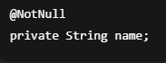
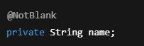
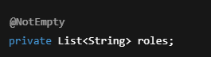
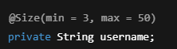
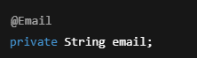
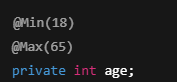
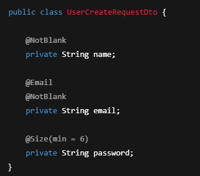
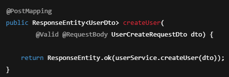

# Spring Validation

Spring Validation, uygulamaya gelen verilerin  
**kurallara uygunluğunu kontrol etmek**  
için kullanılan mekanizmadır.

Özellikle REST API’lerde client’tan gelen  
verilerin doğrulanması için kritik öneme sahiptir.

Validation zaten validasyon anlamına geliyor yani kontroller yapmak için kullanılır.

DTO içinde belirli alanları alıp bunu veri tabanına kaydediyorduk.  
Kaydederken kullanıcı kafasına göre bazı alanları boş geçebilir ya da eksik girebilir,  
bunun için Spring Validation uygularız.

---

## Validation Nedir?

Validation, bir verinin:
- Boş olup olmadığı
- Uzunluğunun uygunluğu
- Formatının doğru olup olmadığı  
gibi kurallara uygunluğunun kontrol edilmesidir.

Amaç:
- Hatalı verinin sisteme girmesini engellemek
- Daha güvenli ve stabil bir uygulama geliştirmek

---

## Spring Validation Neden Kullanılır?

- Client’tan gelen hatalı veriler engellenir
- İş mantığı kirlenmez
- Controller ve Service katmanı sade kalır
- Merkezi ve yönetilebilir doğrulama sağlanır
- Profesyonel REST API geliştirme standardıdır

---

@NotNull:  
Alan null olamaz, ancak boş (empty) olabilir.

@NotBlank:  
String alan null, boş veya sadece boşluk karakterlerinden oluşamaz.

@NotEmpty:  
String, List veya Set gibi yapılar null ya da boş olamaz.

@Min(value):  
Sayısal alanın alabileceği minimum değeri belirtir.

@Max(value):  
Sayısal alanın alabileceği maksimum değeri belirtir.

@Size(min, max):  
String, Collection, Map veya Array türlerinin uzunluk sınırlarını belirler.

@Pattern(regex):  
String alanın belirtilen düzenli ifadeye (regex) uygun olmasını sağlar.

@Email:  
Alan değerinin geçerli bir e-posta formatında olmasını kontrol eder.

@Digits(integer, fraction):  
Sayısal alanın kaç basamaklı tam sayı ve ondalık kısımdan oluşacağını belirtir.

@Past, @Future:  
Tarih alanının geçmişte (@Past) veya gelecekte (@Future) olmasını zorunlu kılar.

@AssertTrue, @AssertFalse:  
Boolean alanın true veya false olmasını zorunlu hale getirir.

@CreditCardNumber:  
Alan değerinin geçerli bir kredi kartı numarası formatında olup olmadığını kontrol eder.

@Valid:  
Bir nesnenin içindeki validation kurallarının çalıştırılmasını sağlar.

---

Bu anotasyonları kullanabilmek için `pom.xml` içine şu dependency’i eklemek lazım:

---

Postman, uygulama veya müşteri üzerinden bir istek geldiğinde  
veri tabanıma kaydetmeden önce controller’ıma gidiyor.  
Controller’ıma girdiğimde servisim datayı alıyor ve  
buradaki anotasyonlarla kontrol ediyor.  

Hatayı, isteği atan tarafa diğer katmanlara gitmeden  
geri dönmüş oluyor.

---

## Validation Nerede Kullanılır?

Genellikle:
- **DTO sınıflarında**
- `@RequestBody` ile gelen verilerde
- Controller katmanında `@Valid` ile birlikte

---

## En Sık Kullanılan Validation Anotasyonları

### @NotNull
Alan null olamaz.

---

### @NotBlank
String alan boş veya sadece boşluk olamaz.

---

### @NotEmpty
String, List veya Set boş olamaz.

---

### @Size
Alan uzunluğunu sınırlar.

---

### @Email
Email formatını kontrol eder.

---

### @Min / @Max
Sayısal alanlar için minimum ve maksimum değer belirler.

---

## DTO Üzerinde Validation Kullanımı

---

## Controller’da @Valid Kullanımı

Validation’ın çalışması için  
Controller’da `@Valid` kullanılır.

📌 `@Valid` yazılmazsa:

- DTO üzerindeki validation kuralları çalışmaz

---

## Validation Hatası Olduğunda Ne Olur?

- Spring otomatik olarak **400 Bad Request** döner
- Hata detayları response body içinde yer alır
- Exception fırlatılır (`MethodArgumentNotValidException`)

---

## Validation + Katmanlı Mimari Akışı

- Client request gönderir
- Controller `@Valid` ile veriyi kontrol eder
- Validation geçerse Service çalışır
- Validation hatalıysa Service’e hiç girilmez
- Client’a hata response’u döner

---

## Özet

- Spring Validation, veri doğrulama mekanizmasıdır
- En çok DTO’lar üzerinde kullanılır
- `@Valid` ile aktif hale gelir
- Hatalı veriler daha başta engellenir
- REST API’lerde olmazsa olmazdır
