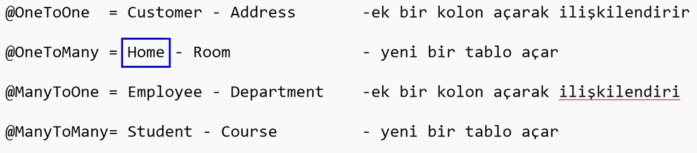
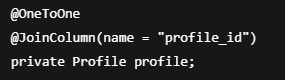
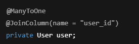
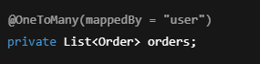
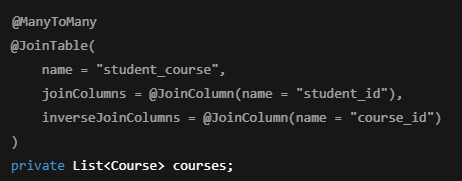
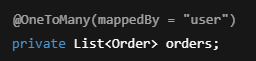
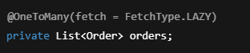
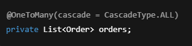

# Spring Data JPA – Relations (İlişkiler)

Spring Data JPA’da **relations**,  
veritabanındaki tablolar arasındaki ilişkilerin  
Java entity’leri üzerinden modellenmesini sağlar.

Entitilerimizi ilişkilendirmek için kullanırız, bunu da Spring tarafında
anotasyonlarla gerçekleştiririz.

---

## Neden Relation Kullanılır?

- Gerçek hayattaki veri ilişkilerini temsil etmek için
- Tekrar eden verileri önlemek için
- Normalizasyon sağlamak için
- Büyük ve sürdürülebilir veritabanı tasarımı yapmak için

---

## JPA’da Temel İlişki Türleri

- OneToOne
- OneToMany
- ManyToOne
- ManyToMany

---

## @OneToOne

İki tablo arasında **bire bir** ilişki olduğunu belirtir.

Örnek senaryo:  
Bir kullanıcının sadece **bir adet** profil bilgisi vardır.

📌 Özellikler:

- Tek bir kayıt ↔ tek bir kayıt
- Foreign key tutulur
- Genellikle `@JoinColumn` ile kullanılır

## @ManyToOne

Bir tablodaki birden fazla kayıt,  
başka bir tablodaki tek bir kayda bağlıdır.

Örnek senaryo:  
Birden fazla sipariş → tek bir kullanıcı

📌 Özellikler:

- En sık kullanılan ilişki türüdür
- Foreign key bu tarafta tutulur
- İlişkinin sahibi (owning side) burasıdır

---

## @OneToMany

Bir tablodaki tek bir kayıt,  
başka bir tablodaki birden fazla kayda karşılık gelir.

Örnek senaryo:  
Bir kullanıcı → birçok sipariş

📌 Özellikler:

- Genellikle `@ManyToOne`’ın ters tarafıdır
- `mappedBy` ile ilişki yönetimi belirtilir
- Foreign key burada tutulmaz

---

## @ManyToMany

İki tablo arasında çoktan çoka ilişki olduğunu belirtir.

Örnek senaryo:  
Bir öğrenci → birçok ders  
Bir ders → birçok öğrenci

📌 Özellikler:

- Ara tablo (join table) oluşur
- Karmaşık yapılar için kullanılır
- Performans açısından dikkatli kullanılmalıdır

---

## mappedBy Nedir?

`mappedBy`, ilişkinin hangi taraftan yönetildiğini belirtir.

📌 Anlamı:

- Foreign key Order tablosundadır
- Bu taraf ilişkiyi sadece okur

---

## FetchType Nedir?

Verinin ne zaman yükleneceğini belirler.

- `FetchType.LAZY` → İhtiyaç olduğunda yüklenir
- `FetchType.EAGER` → Otomatik olarak yüklenir

📌 Öneri:  
Varsayılan olarak **LAZY** tercih edilmelidir.

---

## Cascade Nedir?

Ana entity üzerinde yapılan işlemlerin  
bağlı entity’lere de uygulanmasını sağlar.

📌 Örnek:

- User silinirse → Order’lar da silinir

---

## Relation Kullanırken Dikkat Edilmesi Gerekenler

- EAGER fetch performans sorunlarına yol açabilir
- ManyToMany mümkün olduğunca kaçınılmalıdır
- DTO kullanmadan entity’leri direkt döndürmemek gerekir
- Sonsuz döngü (infinite loop) riskine dikkat edilmelidir

---

## Özet

- JPA ilişkileri tablolar arası bağı temsil eder
- `@ManyToOne` en sık kullanılan ilişkidir
- `mappedBy` ilişki yönetimini belirler
- FetchType ve Cascade performans için kritiktir
- Profesyonel projelerde relations + DTO birlikte kullanılır

