# ⚙️ Property File Configuration (application.properties / application.yml)

## 📌 Nedir?
Spring Boot’ta uygulama ayarları (config) genellikle:
- `application.properties`
- `application.yml`

dosyalarında tutulur.

Bu dosyalar sayesinde:
- port, database bağlantısı, log seviyesi gibi ayarlar yönetilir
- ortam (dev/test/prod) bazlı farklı config yapılabilir
- kodu değiştirmeden davranış değiştirilebilir

Bu yapı spring projesi oluşturulduğunda default olarak projenin içinde gelir.
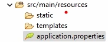

---

## 🧩 application.properties vs application.yml

### ✅ application.properties
Anahtar = değer şeklinde yazılır.

server.port=8080
spring.application.name=demo-app

✅ application.yml

Hiyerarşik (indentation) yapı sunar.

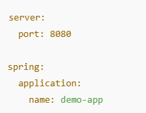

YML’de boşluk (indent) önemlidir.

Sık Kullanılan Ayarlar
🌐 Server Port

🗄️ Database Connection (Örnek: PostgreSQL)

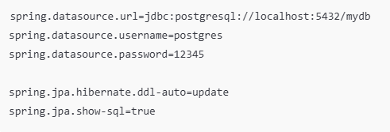

📌 Environment (Profile) Kullanımı
✅ Profile Nedir?

Aynı uygulamanın farklı ortamlarda (dev/test/prod) farklı ayarlarla çalışmasını sağlar.

1️⃣ application-dev.properties
src/main/resources/ içine eklenir:
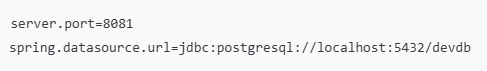

2️⃣ application-prod.properties
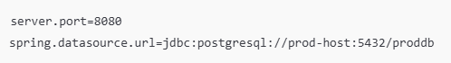

Aktif Profile Belirleme
application.properties üzerinden:
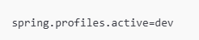

Terminal ile:
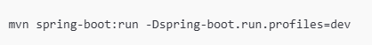

@Value ile Property Okuma
Config dosyasından değer almak için:

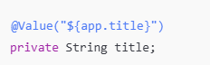
@Value küçük kullanımlarda pratik, ama büyüdükçe yönetmesi zorlaşabilir.

✅ @ConfigurationProperties (Daha Profesyonel Kullanım)
1️⃣ properties
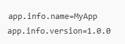

2️⃣ class
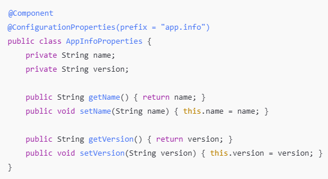
Bu yöntem, çok sayıda config değerini yönetmek için daha temizdir.

🔐 Gizli Bilgiler (Şifre vs) için Not

Şifreleri doğrudan repoya yazmak risklidir.

.env, secrets veya CI/CD secret yönetimi kullanılmalıdır.

GitHub’a açık repo atarken password gibi bilgileri paylaşmamak gerekir.

⚠️ Sık Yapılan Hatalar

YML’de indent hatası (boşluklar)

Yanlış profile aktif etmek

Key isimlerinde yazım hatası (Spring değeri bulamaz)

✅ Özet

Property file configuration sayesinde:

uygulama ayarlarını koddan ayırırız

ortam bazlı farklı yapılandırma yaparız (profiles)

daha temiz ve yönetilebilir bir backend yapısı kurarız

applicaiton.yml
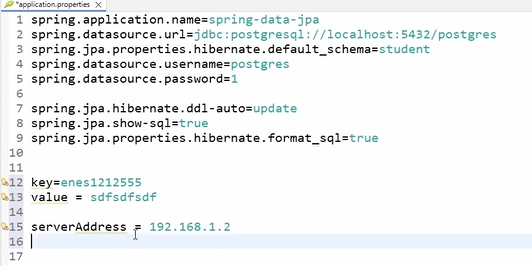

