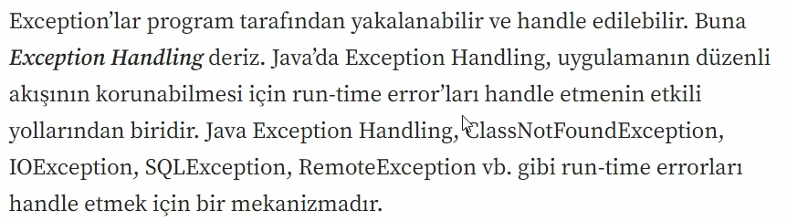
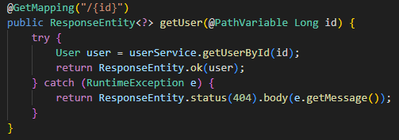
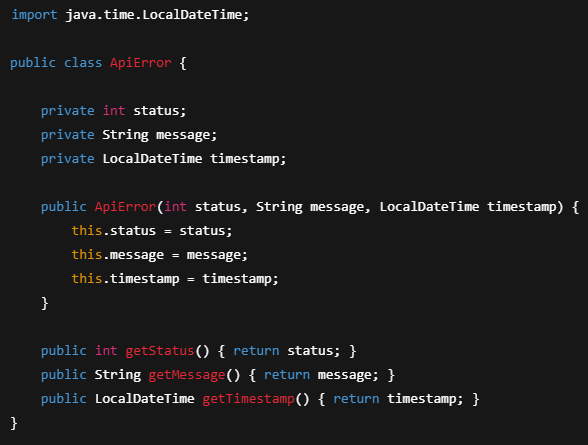
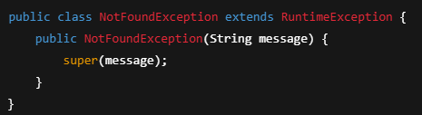
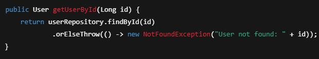
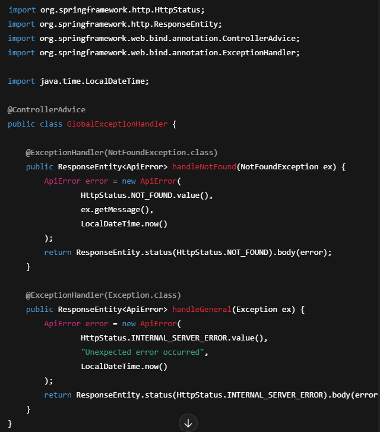
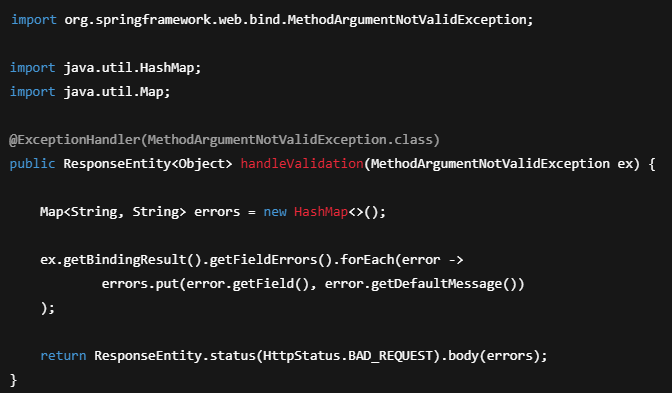

# Spring Boot – Exception Handling (Hata Yönetimi)

Exception Handling, uygulamada oluşan hataları **kontrollü şekilde yakalayıp**
client’a **anlamlı ve standart bir response** döndürmemizi sağlar.

REST API’lerde amaç:
- Uygulamanın patlamasını engellemek
- Hataları tek bir merkezden yönetmek
- Her hatada tutarlı (standard) response üretmek

---

## Neden Exception Handling Kullanılır?

- Hata mesajları kontrolsüz şekilde client’a gitmez
- API response formatı standart olur
- Debug ve bakım kolaylaşır
- Kullanıcıya daha anlaşılır hata döner
- Validation ve business hataları ayrıştırılır

---

## Exception Nedir?

Exception, uygulama çalışırken ortaya çıkan beklenmeyen durumdur.

Örnek:
- Veritabanında kayıt yok (`User not found`)
- Hatalı request body
- Validation hatası
- Null pointer gibi runtime hataları

---

## 1) Lokal Exception Handling (try-catch)

Hata yakalama ilgili metotta yapılır.

📌 Dezavantaj:

- Her endpoint’e aynı try-catch tekrar tekrar yazılır
- Kod kalabalıklaşır
- Merkezi yönetim olmaz

## 2) Global Exception Handling (Önerilen)

Spring Boot’ta global hata yönetimi için:

- `@ControllerAdvice`
- `@ExceptionHandler`

kullanılır.

Bu sayede hataları tek bir yerde yakalarız.

---

## Hata Response Modeli (ApiError)

Client’a döneceğimiz hata formatını standartlaştırırız.

---

## Custom Exception Örneği (NotFound)

---

## Service İçinde Kullanımı

---

## Global Exception Handler (ControllerAdvice)

📌 Ne oldu?

- `NotFoundException` geldiğinde **404** dönüyor
- Diğer tüm hatalarda **500** dönüyor

---

## Validation Exception Handling (MethodArgumentNotValidException)

`@Valid` ile gelen validation hatalarında Spring bu exception’ı fırlatır:

`MethodArgumentNotValidException`

Validation hatalarını daha anlamlı dönmek için:

📌 Bu yapı sayesinde client şöyle bir response alır:

- Hangi field hata verdi
- Hata mesajı ne

---

## Özet

- Exception Handling hataları kontrollü yönetmeyi sağlar
- Lokal try-catch yerine global yapı önerilir
- `@ControllerAdvice` + `@ExceptionHandler` ile merkezi yönetim kurulur
- Custom exception ile business hataları netleşir
- Validation hataları için `MethodArgumentNotValidException` yakalanır
