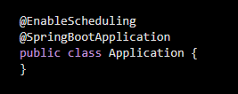
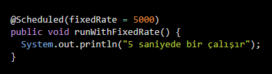
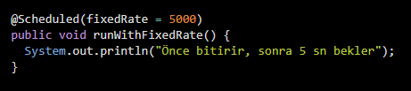
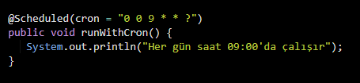
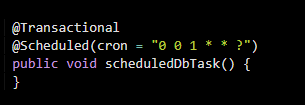
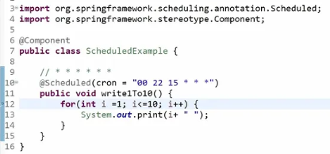

# ⏰ Scheduled (Zamanlanmış Görevler)

## 📌 Scheduled Nedir?
`@Scheduled`, Spring Boot uygulamalarında **belirli aralıklarla veya belirli bir zamanda**
çalışması gereken görevleri tanımlamak için kullanılır.
Planlamak için kullanılan bir anatasyondur. Bu anatasyonu aktif hale getirebilmek için @EnableScheduling anatasyonuyla bunu aktif hale getiriyoruz.

Bu görevler genellikle:
- periyodik kontroller
- rapor üretimi
- log temizleme
- otomatik bildirim gönderme

gibi işlemler için kullanılır.

@Scheduled(fixedDelay=1000,initialDelay=1000)
@Scheduled(cron=”0 10 15 * ?”)  → sn , dk, saat , gün ,ay haftanın hangi günü

---

## ⚙️ Scheduled Kullanımı

### 1️⃣ Scheduled Özelliğini Aktif Etme
Scheduled kullanabilmek için uygulama seviyesinde aktif edilmesi gerekir.

🧩 @Scheduled Annotation Türleri
🔁 fixedRate

Belirtilen süre dolduğu anda metodu tekrar çalıştırır
Önceki işlem bitmese bile yeni görev başlar.

⏳ fixedDelay

Metot çalışmasını bitirdikten sonra belirtilen süre beklenir.

🕰️ cron

Cron ifadeleriyle zaman bazlı çalışma sağlar.

Cron İfadesi Yapısı

📌 Örnek Cron İfadeleri
**Her saat başı**  0 0 * * * ?
**Her gün gece 00:00**  0 0 0 * * ?
**5 dakikada bir**   0 */5 * * * ?
**Hafta içi her gün 09:00**   0 0 9 ? * MON-FRI

⚠️ Dikkat Edilmesi Gerekenler

@Scheduled metotları void olmalıdır

Parametre alamaz

Varsayılan olarak single-thread çalışır

Uzun süren işlemler için ayrı thread pool önerilir

🔄 Scheduled & Transaction

Zamanlanmış görevlerde:

database işlemleri varsa

transaction yönetimi dikkatle yapılmalıdır

QA Perspektifinden Scheduled

Zaman bağımlı senaryoların test edilmesi zordur

Loglama ve test ortamında süre kısaltma önemlidir

Mock clock veya profil bazlı yapı tercih edilebilir

✅ Özet

@Scheduled, Spring Boot projelerinde:

otomatik

periyodik

zaman kontrollü

işlerin yönetilmesini sağlar.

Doğru yapılandırıldığında sistem yükünü azaltır ve operasyonel işleri otomatikleştirir.

Bir `@Scheduled` görevini kullanabilmek için bazı temel adımların uygulanması gerekir.

Öncelikle, `@SpringBootApplication` anotasyonu ile işaretlenmiş olan ana sınıfımız,
`@EnableScheduling` anotasyonu ile işaretlenerek **zamanlanmış görevler aktif hale getirilir**.

Zamanlanmış metodu içeren sınıfın ise `@Component` ile işaretlenmesi gerekir.
Bu sayede ilgili sınıf **Spring Container** içerisine bir *bean* olarak eklenir ve
nesnesi oluşturulur.

Spring tarafından nesnesi oluşturulmayan sınıfların içerisindeki metotlar
çalıştırılamaz. Bu nedenle `@Component` kullanımı kritik öneme sahiptir.

Son olarak, çalışmasını istediğimiz metot `@Scheduled` anotasyonu ile işaretlenir
ve bu sayede belirlenen zaman aralıklarında otomatik olarak çalışması sağlanır.

### ❓ Neden `@Component` Olmazsa `@Scheduled` Çalışmaz?

Spring Boot uygulamalarında `@Scheduled` anotasyonu **tek başına yeterli değildir**.

`@Scheduled` ile işaretlenen metotların çalışabilmesi için,
bu metodun bulunduğu sınıfın **Spring Container** tarafından yönetilen
bir *bean* olması gerekir.

`@Component` anotasyonu, ilgili sınıfın Spring tarafından taranmasını
ve uygulama ayağa kalkarken nesnesinin oluşturulmasını sağlar.

Eğer bir sınıf `@Component` (veya `@Service`, `@Repository` gibi bir stereotype)
ile işaretlenmemişse:
- Spring bu sınıfın nesnesini oluşturmaz
- Nesnesi oluşturulmayan sınıfların metotları çalıştırılamaz
- Dolayısıyla `@Scheduled` anotasyonu da tetiklenmez

Özetle, `@Scheduled` görevlerinin çalışabilmesi için
ilgili sınıfın mutlaka **Spring tarafından yönetilen bir bean** olması gerekir.

@Service, @Repository, @Component → hepsi @Component’in özel halleridir.
Yani @Service ile işaretlenmiş bir sınıfta da @Scheduled sorunsuz çalışır.
