# ✅ JUnit 5 (JUnit Jupiter)

## 📌 JUnit 5 Nedir?
JUnit 5, Java projelerinde **unit test** yazmak için kullanılan modern test framework’üdür.  
JUnit 5 temelde 3 parçadan oluşur:
- **JUnit Platform**: Testleri çalıştıran altyapı
- **JUnit Jupiter**: JUnit 5 test API’si (en çok kullandığımız kısım)
- **JUnit Vintage**: JUnit 4 testlerini çalıştırma desteği

---

## 🎯 Neden Test Yazarız?
- Kodun doğru çalıştığını kanıtlamak
- Refactor yaparken güvenli ilerlemek
- Hataları erken yakalamak
- Kod kalitesini ve sürdürülebilirliği artırmak

---

## ⚙️ Maven Dependency
Spring Boot kullanıyorsan genelde zaten gelir (`spring-boot-starter-test`).  
Eklemek istersen:

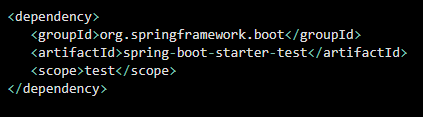

Sadece JUnit 5 istersem:

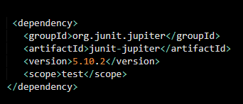

🧩 Temel Anotasyonlar

✅ @Test

Test metodu olduğunu belirtir.

Assertions (Beklenen Sonuç Kontrolü)

Assertions, testin pass/fail olmasına karar verir.

assertEquals

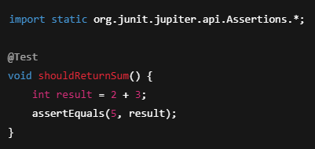

assertTrue / assertFalse

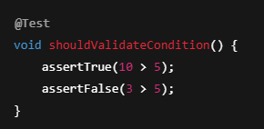

assertNotNull / assertNull

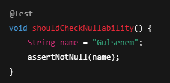

assertThrows

Beklenen exception’ı kontrol eder.

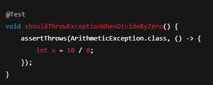

assertAll

Birden fazla assertion’ı birlikte çalıştırır (hepsi raporlanır).

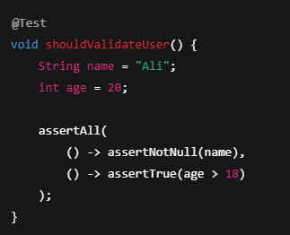

🔁 Test Lifecycle (Ömür Döngüsü)

@BeforeEach / @AfterEach

Her testten önce/sonra çalışır.

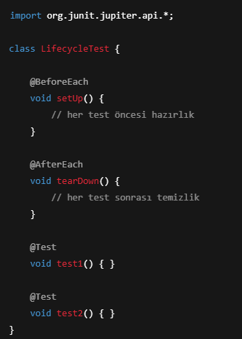

@BeforeAll / @AfterAll

Tüm testlerden önce/sonra 1 kez çalışır. static olmalıdır.

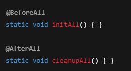

Testleri Daha Okunaklı Yapmak

@DisplayName

Test ismini daha anlaşılır gösterir.

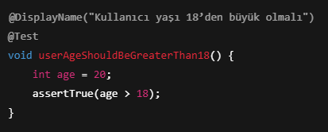

@Disabled

Testi geçici olarak devre dışı bırakır.

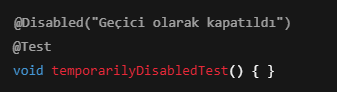

🔂 Parametrized Test (Bir Testi Farklı Verilerle Çalıştırma)

@ValueSource

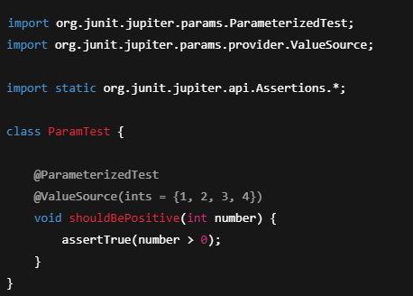

@CsvSource

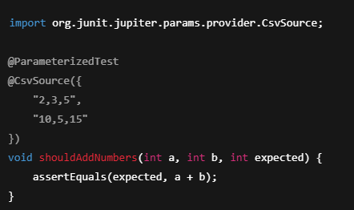

Unit Test Mantığı (Arrange - Act - Assert)

Test yazarken en net yaklaşım:

Arrange: Test verisini hazırla

Act: Metodu çalıştır

Assert: Beklenen sonucu doğrula

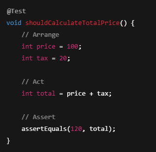

Spring Boot ile Test (Kısa Notlar)

@SpringBootTest

Uygulamayı ayağa kaldırarak test eder (integration test’e yakındır).

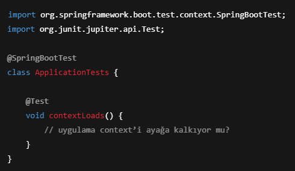

Not: @SpringBootTest ağır olabilir, her testte kullanmak yerine gerekli yerde kullanılır.

⚠️ Sık Yapılan Hatalar

- Assertion yazmadan test bırakmak (test “geçer” ama doğrulama yok)

- Her testte @SpringBootTest kullanmak (testleri yavaşlatır)

- Testlerin birbirine bağımlı olması (sıra değişince patlar)

✅ Özet

JUnit 5 ile:

- @Test ve assertions kullanarak unit test yazılır

- @BeforeEach / @AfterEach ile hazırlık ve temizlik yapılır

- Parametrized test ile aynı test farklı verilerle çalıştırılır

- Spring Boot tarafında @SpringBootTest ile uygulama context’i test edilebilir