## 🧪 Mockito (Mocking Framework)

## 📌 Mockito Nedir?
Mockito, unit test yazarken **bağımlılıkları taklit (mock) etmek**
için kullanılan bir framework’tür.

## 🎯 Amaç
- Gerçek bağımlılıkları (database, servis, API vb.) kullanmadan test yazmak
- Sadece test edilen sınıfa odaklanmak
- İzole (bağımsız) ve hızlı testler yazmak

---

## 🎯 Neden Mock Kullanırız?
- Database’e bağlanmadan test yapmak
- Dış servislere istek atmadan sonuç kontrol etmek
- Testleri daha hızlı ve deterministik hale getirmek

---

## ⚙️ Gerekli Dependency

Spring Boot projelerinde genelde `spring-boot-starter-test` ile birlikte gelir.

Ayrıca eklemek istersen:

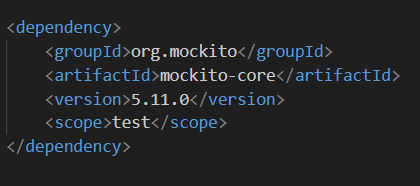

Temel Mockito Anotasyonları

@Mock

Bağımlılığı sahte (mock) olarak oluşturur.

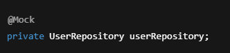

@InjectMocks

Test edilen sınıfın içerisine mock’ları otomatik enjekte eder.

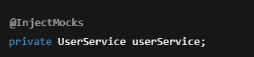

@ExtendWith(MockitoExtension.class)

JUnit 5 ile Mockito’yu entegre eder.

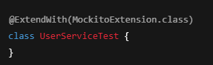

🔁 when – thenReturn Kullanımı

Mock nesnenin davranışını tanımlar.

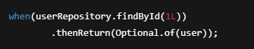

Tam örnek:

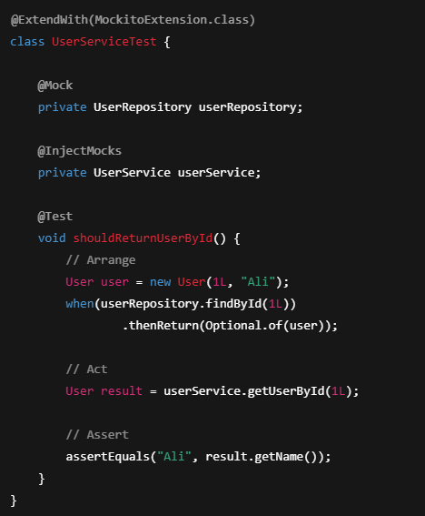

verify Kullanımı

Mock metodun çağrılıp çağrılmadığını kontrol eder.

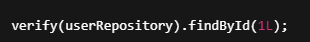

Kaç kez çağrıldığını kontrol etmek için:

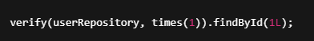

Hiç çağrılmadığını kontrol etmek için:

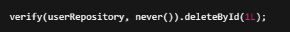

⚠️ Exception Fırlatma (thenThrow)

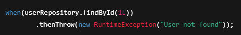

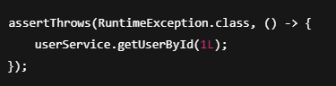

Mock vs Real Object

- Mock → Davranışı biz belirleriz

- Gerçek nesne → Gerçek implementasyon çalışır

- Unit test’te amaç:

 Gerçek bağımlılıkları değil, test edilen sınıfı sınamak

QA Perspektifinden Mockito

- Unit test’ler hızlı geri bildirim sağlar

- Hata kökü daha kolay bulunur

- Entegrasyon testlerinden önce güvenli alan oluşturur

❌ Sık Yapılan Hatalar

- Test edilen sınıfı da mock’lamak

- verify kullanmadan test yazmak

- Her şeyi mock’layıp testin anlamını kaybettirmek

✅ Özet

Mockito ile:

- Bağımlılıklar izole edilir

- Unit test’ler hızlanır

- Testler daha okunur ve sürdürülebilir olur

- JUnit 5 + Mockito birlikte kullanıldığında,
  temiz ve güvenilir unit testler yazmak mümkündür.

