# Spring Security + JWT (JSON Web Token)

Spring Security + JWT,  
uygulamalarda **kimlik doğrulama (authentication)** ve  
**yetkilendirme (authorization)** işlemlerini sağlamak için kullanılır.

JWT, **stateless (durumsuz)** bir güvenlik mekanizması sunar.

---

## Neden JWT Kullanılır?

- Session tutmaya gerek kalmaz
- Microservice mimarilere uygundur
- Ölçeklenebilir ve performanslıdır
- Mobil ve frontend uygulamalarla uyumludur
- REST API’ler için standart çözümdür

---

## Authentication ve Authorization Farkı

- **Authentication:** Kullanıcı kimliğini doğrular  
  (Kullanıcı gerçekten kim?)
- **Authorization:** Kullanıcının yetkilerini kontrol eder  
  (Bu işlemi yapmaya yetkisi var mı?)

---

## JWT Nedir?

JWT (JSON Web Token),  
kullanıcıya ait bilgileri **şifreli ve imzalı** şekilde taşıyan bir tokendır.

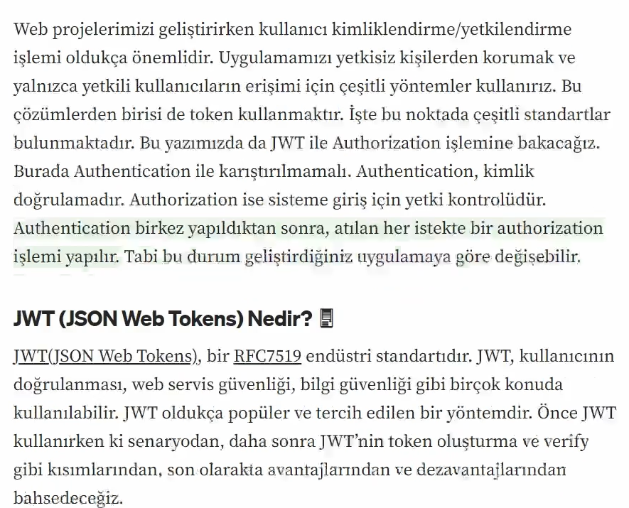

**JWT (JSON Web Token)**, web uygulamalarında kullanıcı kimlik doğrulama ve yetkilendirme işlemlerinde kullanılan bir standarttır. JWT, kullanıcılar arasında güvenli veri alışverişi yapmak için kullanılan bir JSON tabanlı token (jeton) formatıdır. Web uygulamalarında genellikle oturum yönetimi ve API erişim kontrolü için kullanılır.

- jwt (json web tokens), bir tane token oluşturucaz ve oluşturmuş olduğumuz tokenla şu servisi çağırmak için kullanılır.

JWT üç parçadan oluşur:

HEADER.PAYLOAD.SIGNATURE

---

## JWT'nin Temel Bileşenleri

### Header
- Token tipi (JWT)
- Kullanılan imzalama algoritması

JWT'nin başlık kısmı, genellikle iki bileşenden oluşur:

- `alg` (algorithm): İmzalama algoritması, örneğin HMAC SHA256, RSA, vb.
- `typ` (type): Token türünü belirtir, genellikle `JWT` olarak belirlenir.

Örnek Header:

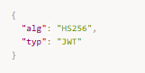

---

### Payload
- Kullanıcı bilgileri (username, role vb.)
- Token’ın geçerlilik süresi

Payload, kullanıcı bilgilerini (claims) içerir. Bu bilgiler, kullanıcı kimliği, izinler, token geçerlilik süresi gibi veriler olabilir. Payload, kimlik doğrulama ve yetkilendirme için gereken bilgileri taşır. Ancak unutulmamalıdır ki payload verileri şifrelenmemiştir, sadece base64 ile kodlanır.

- `sub` (subject): Kullanıcı ID'si gibi bir bilgiyi temsil eder.
- `iat` (issued at): Token'in oluşturulma zamanını belirtir.
- `exp` (expiration): Token'in son kullanma tarihi.

Örnek Payload:

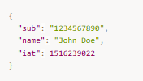

---

### Signature
- Token’ın değiştirilmediğini garanti eder

JWT'nin güvenliğini sağlamak için imza kullanılır. İmza, header ve payload birleşiminden oluşturulur ve bir şifreleme algoritması kullanılarak imzalanır. İmzanın doğruluğu, token'in değiştirilip değiştirilmediğini kontrol etmek için kullanılır.

İmza şu şekilde oluşturulur:

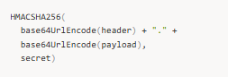

---

## JWT Akış Mantığı

1. Kullanıcı login isteği gönderir
2. Username & password doğrulanır
3. JWT token üretilir
4. Token client’a döndürülür
5. Client her istekte token’ı header’da gönderir
6. Token doğrulanır
7. Yetki kontrolü yapılır

---

### JWT'nin Çalışma Prensibi

1. Kullanıcı, login olduktan sonra sunucu tarafından bir JWT token'ı oluşturulur ve istemciye gönderilir.
2. İstemci, bu JWT'yi her API isteğinde `Authorization` başlığı altında gönderir.
3. Sunucu, gelen JWT'yi doğrular ve geçerliyse kullanıcının erişimini sağlar.

---

### Avantajları

- **Stateless**: Sunucu tarafında herhangi bir oturum verisi tutmaz, her API isteğiyle birlikte token gönderilir.
- **Kolay Entegre Edilebilir**: Web uygulamaları ve mobil uygulamalar arasında kolayca entegre edilebilir.
- **Verimli**: JWT, JSON formatında verimli bir şekilde veri taşır ve özellikle mikro hizmetler mimarisinde çok faydalıdır.

---

### Dezavantajları

- **Token'in Hacmi**: Token'in içerdiği veri arttıkça token boyutu büyür.
- **Token'in Geçerliliği**: Token geçerlilik süresi dolduğunda yenilenmesi gerekir, bu da yönetimsel zorluklar oluşturabilir.

---

## Spring Security Nedir?

Spring Security,  
Spring uygulamalarında güvenlik işlemlerini yöneten framework’tür.

- Authentication
- Authorization
- CSRF
- CORS
- Filter yapıları

---

## Spring Security Dependency

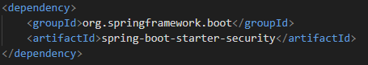

---

## JWT Dependency (jjwt)

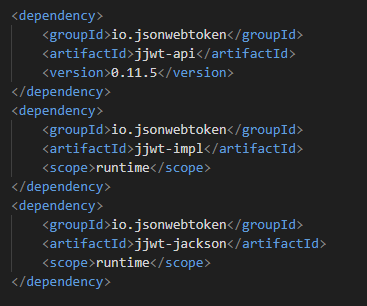

---

## Security Temel Yapısı

Spring Security’de güvenlik:

- Filter Chain üzerinden çalışır
- Her request filtrelerden geçer
- JWT kontrolü filter içinde yapılır

---

## Stateless Security Yapısı

JWT ile:

- Server tarafında session tutulmaz
- Her request bağımsızdır
- Token doğrulaması her istekte yapılır

---

## JWT Nerede Taşınır?

HTTP Header içinde:

---

## Özet

- JWT, stateless authentication sağlar
- Spring Security güvenlik altyapısını sunar
- Authentication ve Authorization ayrıdır
- JWT, REST API’lerde standarttır
- Token header üzerinden taşınır

## JWT'yi Java Spring Boot Projelerinde Kullanma

JWT'yi Java Spring Boot projelerinde nasıl kullanacağımızı göstermek için  
örnek bir kod üzerinden açıklamalara geçebiliriz.

---

### 1. Gerekli Bağımlılıkları Ekleyelim

İlk olarak, Spring Boot projesine JWT desteği eklemek için gerekli bağımlılıkları  
`pom.xml` dosyasına ekleyelim.  
Spring Security ve JWT kütüphanesini dahil etmeliyiz.

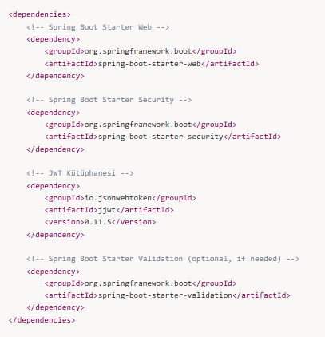

---

### 2. JWT Token Üretimi ve Doğrulama

JWT token'ı oluşturmak ve doğrulamak için bir yardımcı sınıf (`JwtUtils`) yazalım.

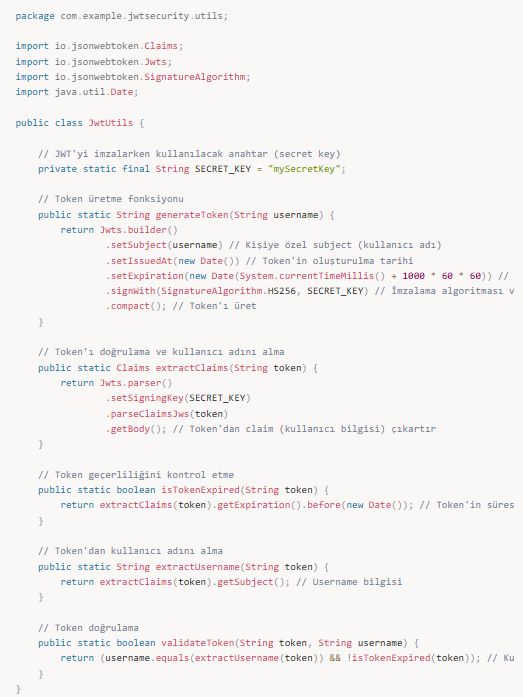

---

### 3. Authentication Filter (Kimlik Doğrulama Filtresi)

Bir JWT token'ı, gelen her istekte doğrulamak için bir filtre kullanmamız gerekecek.  
Bu filtre, kullanıcıdan gelen her istek için JWT'yi kontrol eder.

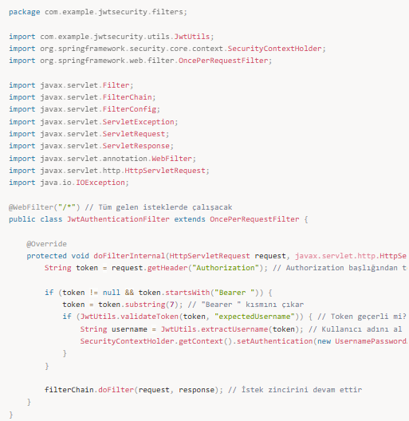

---

### 4. Spring Security Konfigürasyonu

JWT doğrulaması yapmak için Spring Security yapılandırmasını da eklememiz gerekiyor.  
Bu yapılandırma, her gelen isteği filtre eder ve JWT doğrulaması yapar.

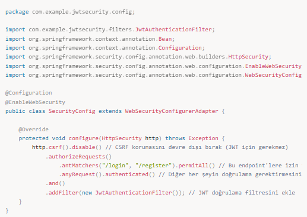

---

### 5. Login Endpoint ve Token Üretme

Son olarak, bir `Login` endpoint'i oluşturalım,  
kullanıcı adı ve şifre ile doğrulama yaparak JWT token'ı geri dönsün.

---

### 6. Kullanıcı Giriş İsteği

Kullanıcı, `/login` endpoint'ine bir POST isteği gönderdiğinde,  
doğru kullanıcı adı ve şifre ile JWT token'ı alır.

**İstek:**

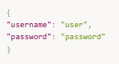

**Yanıt:**

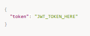

---

### Özetle:

- **JWT oluşturma ve doğrulama** işlemi için `JwtUtils` sınıfını oluşturduk.
- **JWT Authentication Filter** ekledik ve gelen isteklerde token doğrulaması yaptık.
- Spring Security konfigürasyonunda JWT doğrulaması için bir filtre kullandık.
- Kullanıcı başarılı bir şekilde giriş yaptıktan sonra **JWT token'ı** alabilir ve
  sonraki API isteklerinde bu token'ı kullanabilir.

---

### JWT Akışının Detaylı Açıklaması

1. **JWT Token Üretimi**:
   - Kullanıcı, giriş yapmak için bir `POST /login` isteği gönderdiğinde, sunucu bu isteği
     `AuthController` sınıfındaki `login` metoduna yönlendirir.
   - Bu metod, kullanıcı adı ve şifreyi doğrular (bu örnekte basitçe sabit değerler kullanıyoruz).
   - Eğer kullanıcı adı ve şifre doğruysa, `JwtUtils.generateToken` metodu çağrılır.
   - JWT token, kullanıcıyı tanımlayan bilgileri (subject, yani kullanıcı adı) ve
     token'ın geçerlilik süresi gibi verileri içerir.

2. **Token'ın İstemciden Sunucuya Gönderilmesi**:
   - İstemci (örneğin bir frontend uygulaması veya mobil cihaz), JWT token'ını aldıktan sonra,
     bunu sonraki API isteklerinde `Authorization` başlığı altında
     **Bearer {token}** formatında sunucuya gönderir.

3. **JWT Doğrulama**:
   - Spring Security yapılandırmasında, her gelen isteği kontrol etmek için
     bir `JwtAuthenticationFilter` sınıfı ekledik.
   - Bu filtre, gelen istekleri kontrol eder ve eğer `Authorization` başlığı içinde
     bir JWT token varsa, bu token'ı çıkarır ve doğrulamak için
     `JwtUtils.validateToken` metodunu çağırır.
   - Eğer token geçerli ve süresi dolmamışsa, filtre bu token'dan kullanıcı adını
     çıkartır ve Spring Security'nin `SecurityContextHolder`'ına kullanıcıyı ekler.

4. **Spring Security Yapılandırması**:
   - Spring Security yapılandırmasında `HttpSecurity` ayarlarıyla hangi endpoint'lerin
     herkese açık olduğunu ve hangilerinin kimlik doğrulaması gerektirdiğini belirledik.
   - `JwtAuthenticationFilter`, Spring Security filtre zincirine eklenerek
     her istekte JWT doğrulaması yapılır.

5. **Sonuç**:
   - Kullanıcı başarılı bir şekilde giriş yaptıktan sonra, her API isteğinde JWT token'ı
     doğrulanır ve geçerli ise kullanıcıya ait kimlik bilgileri güvenlik bağlamına eklenir.
   - Bu sayede API'ye güvenli bir şekilde erişim sağlanır.

---

Java Spring Boot uygulamasında **JWT (JSON Web Token)** ile kullanıcı kimlik
doğrulaması ve güvenliği sağlamaktır.  
İlk olarak, kullanıcı başarılı bir şekilde giriş yaptıktan sonra bir JWT token'ı ürettik.
Bu token, kullanıcı bilgilerini (kullanıcı adı gibi) içerir ve güvenli bir şekilde
imzalanarak oluşturulur.

Sonrasında, Spring Security ve özel bir JWT doğrulama filtresi kullanarak,
gelen her API isteğinde token'ın geçerliliğini kontrol ettik.
Eğer token geçerli ve süresi dolmamışsa, kullanıcıya ait kimlik bilgilerini
güvenlik bağlamına ekledik ve API erişimini sağladık.

Bu sayede, uygulama **stateless** bir şekilde çalışarak her API isteğinde
kimlik doğrulamasını JWT üzerinden gerçekleştirdi.

---

Tokenın içerisinde iki tane nokta vardır ve bu iki nokta tokenı üç parçaya böler.

- Tokenın birinci parçası **Header**’dır.  
  Header içinde, bu tokenı hangi algoritma tipiyle oluşturduğumuz ve
  nasıl hashlediğimiz bilgisi yer alır.
- İkinci parçası **Payload**’dır.  
  Tokenın oluşturulma süresi, ne zaman biteceği ve tokenın içerisindeki
  username gibi bilgiler burada bulunur.
- Son parça **Verify Signature**’dır.  
  Token, belirli bir imzayla kriptolanır.

Gelen tokenı filtreden geçiririm, başarılıysa içeriye alırım.

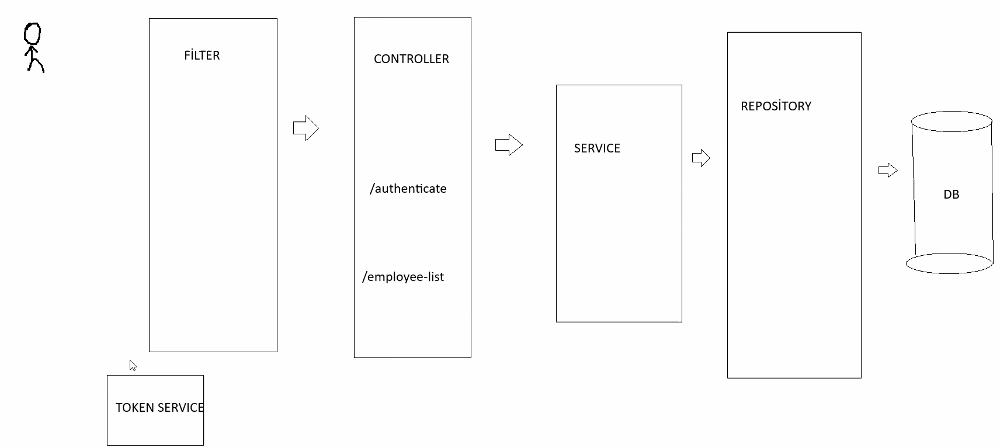

