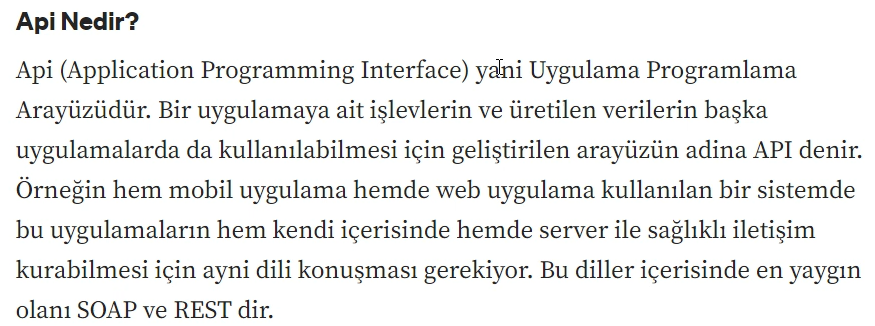
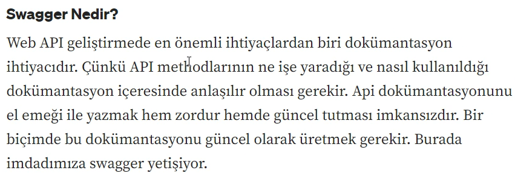
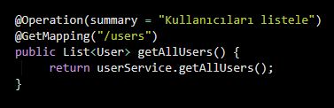
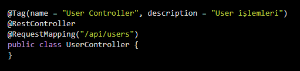
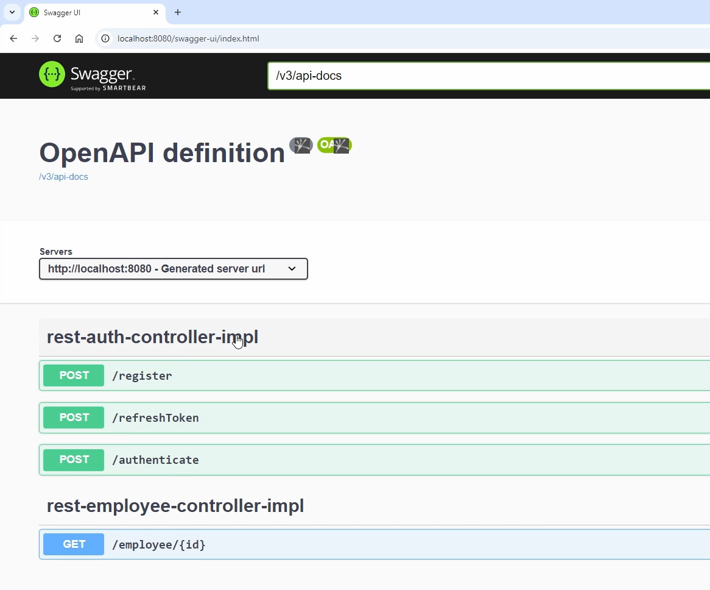

#  Swagger (OpenAPI)

##  Swagger Nedir?
Swagger, REST API’lerin **dokümantasyonunu otomatik olarak oluşturan**
ve API’lerin test edilmesini sağlayan bir araçtır.

Yazdığımız servisleri kullanabilmek için bizlere bir tane dokümantasyon sunuyor. Bizler bu sayfayı kullanarak yazdığımız servisleri kolayca kullanabiliyoruz.

Spring Boot projelerinde genellikle **OpenAPI Specification** üzerinden kullanılır.

---

##  Neden Kullanılır?
- API endpoint’lerini görsel olarak listelemek için
- Request / Response yapılarını net görmek için
- Backend–Frontend–QA ekipleri arasında ortak bir dil oluşturmak için
- Manuel API testlerini kolaylaştırmak için

---

##  Swagger & OpenAPI İlişkisi
- **OpenAPI** → API’lerin nasıl tanımlanacağını belirleyen standarttır
- **Swagger** → OpenAPI standartlarını kullanan araçlar bütünüdür

---

## ⚙️ Spring Boot’ta Swagger Kullanımı

###  Gerekli Dependency
Spring Boot projelerinde en yaygın kullanım(Swaggerı Projeye Dahil Etme):

<dependency>
    <groupId>org.springdoc</groupId>
    <artifactId>springdoc-openapi-starter-webmvc-ui</artifactId>
    <version>2.5.0</version>
</dependency>

🌐 Swagger UI’ye Erişim

Uygulama ayağa kalktıktan sonra:
http://localhost:8080/swagger-ui.html
veya
http://localhost:8080/swagger-ui/index.html

🧪 Swagger ile API Testi

Swagger UI üzerinden:

GET / POST / PUT / DELETE istekleri gönderilebilir

Request body manuel girilebilir

Response status ve body görüntülenebilir

Bu özellik özellikle manuel API testleri için oldukça faydalıdır.

📝 Controller Üzerinde Açıklama Kullanımı

⚠️ Dikkat Edilmesi Gerekenler

Production ortamında Swagger UI genellikle kapatılır

Güvenlik nedeniyle yetkisiz erişim sınırlandırılmalıdır

JWT kullanılan projelerde Swagger konfigürasyonu gerekir

🧠 QA Perspektifinden Swagger

Endpoint’leri hızlıca keşfetmeyi sağlar

Test senaryosu yazarken referans olarak kullanılır

Postman öncesi hızlı kontrol imkanı sunar

Backend bağımsız test yapmayı kolaylaştırır

✅ Özet

Swagger, Spring Boot projelerinde API’lerin:

Dokümantasyonunu

Test edilebilirliğini

Anlaşılabilirliğini

artıran güçlü ve pratik bir araçtır.

Springin kütüphanesi bütün servisleri controller controller bölerek controllerların altında bulunan servisler o servislerin metot tipleri , o servisin isteği , tipi , request olarak bizden ne alıyor reponce olarak ne dönüyor gibi bunları detaylı bir şekilde gördüğümüz bir sayfa sunuyor. Bizde bunların testlerini hızlı bir şekilde gerçekleştirmiş oluyoruz.

