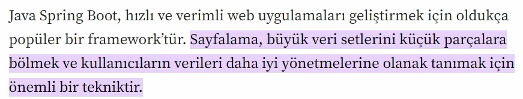
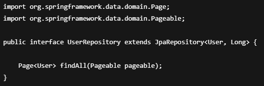
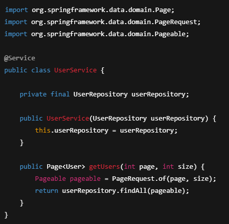
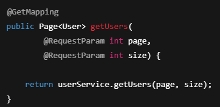
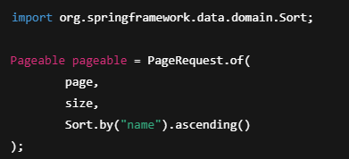
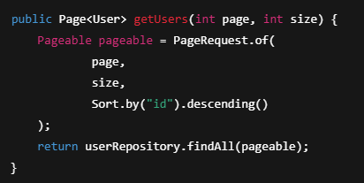
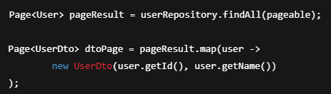

# Spring Data JPA – Pagination & Sorting

Pagination (sayfalama), Sorting (sıralama)

Pagination ve Sorting,  
büyük veri setleriyle çalışırken  
**performansı artırmak** ve  
**kullanıcıya kontrollü veri sunmak**  
için kullanılan yapılardır.

---

## Pagination Nedir?

Pagination, verilerin **parça parça (sayfa sayfa)** getirilmesini sağlar.

Amaç:
- Tüm veriyi tek seferde çekmemek
- Performans problemlerini önlemek
- Kullanıcı deneyimini artırmak

Örnek:
- 1000 kayıt var
- Her sayfada 10 kayıt
- Toplam 100 sayfa

---

## Sorting Nedir?

Sorting, verilerin belirli bir alana göre  
**artan (ASC)** veya **azalan (DESC)** şekilde sıralanmasını sağlar.

Örnek:
- İsme göre sırala
- Tarihe göre azalan sırala

---

## Spring Data JPA’da Pagination Nasıl Yapılır?

Spring Data JPA, pagination için  
`Pageable` ve `Page` yapılarını sunar.

---

## Pageable Nedir?

`Pageable`, sayfalama bilgisini tutar:
- Sayfa numarası
- Sayfa boyutu
- Sıralama bilgisi

---

## Repository’de Pageable Kullanımı

📌 `findAll(Pageable pageable)` metodu otomatik olarak gelir.

---

## Service Katmanında Pagination

📌 Sayfa numarası **0’dan** başlar.

---

## Controller Katmanında Pagination

📌 Örnek istek:

---

## Sorting Kullanımı

📌 Azalan sıralama:

---

## Pagination + Sorting Birlikte Kullanımı

---

## Page Nesnesi İçeriği

`Page<T>` aşağıdaki bilgileri içerir:

- `getContent()` → Sayfadaki veriler
- `getTotalElements()` → Toplam kayıt sayısı
- `getTotalPages()` → Toplam sayfa sayısı
- `getNumber()` → Mevcut sayfa numarası
- `isFirst()` / `isLast()`

---

## Pagination + DTO Kullanımı

Pagination entity yerine DTO ile de kullanılabilir.

---

## Pagination Kullanmanın Avantajları

- Büyük veri setlerinde performans artar
- Bellek kullanımı azalır
- Daha kontrollü API response’ları sağlanır
- Frontend tarafı için idealdir

---

## Dikkat Edilmesi Gerekenler

- Page index **0’dan** başlar
- Büyük page size performans sorunlarına yol açabilir
- Sorting alanı entity field adıyla aynı olmalıdır

---

## Özet

- Pagination veriyi sayfa sayfa getirir
- Sorting veriyi sıralar
- Spring Data JPA’da `Pageable` ve `Page` kullanılır
- Pagination ve Sorting birlikte kullanılabilir
- Profesyonel REST API’lerde standarttır
